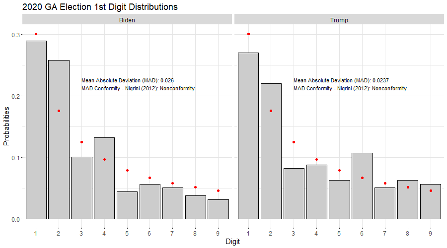

```{r setup, include=FALSE}
#knitr::opts_chunk$set(echo = TRUE)
library(benford.analysis)
library(BeyondBenford)
library(shiny)
library(shinyWidgets)
library(plotly)
library(openxlsx)
library(ggpubr)
source('dig.distjd.R')
presdata <- read.csv('countypres_2000-2016.csv', stringsAsFactors = F)
presdata <- subset(presdata, party %in% c('democrat', 'republican'))

```

Robert Bonavito, CPA posted a video comparing the distribution of the first digit of the vote totals in GA counties to the expectation from Benford's Law <https://youtu.be/DoF3WS42w3M?t=573> and states the results are "...pointing to massive fraud". That video has been viewed almost 100,000 times as of Nov 22. But do the data really indicate massive fraud? ***The short answer is no. ***

Benford's Law describes the frequency distribution of specific digits occurring in certain natural number processes. When processes that generally conform to Benford's Law expectations deviate from them, it can be an indication of manipulation. ***One reason the short answer is no is that even if the data deviate wildly from expectations, it is not possible to conclude they are fraudulent*** without examining the structure of the data to determine if the results are actually unusual or unexpected (for example, examining the number of registered voters by county), and *then actually investigating the anomalies.*

***Another reason the short answer is no is that the data do not wildly deviate from the expectations of Benford's Law.*** Bonavito performed a visual inspection of the frequency distribution of 1st digits in the vote counts by county in the GA election data compared to expected values from Benford's Law. It's trivial to demonstrate that with a sample size of 159 counties, the GA election data are typical even for manufactured data that perfectly converge to Benford's Law (I do so later in this document). Bonavito seems to believe that is sample size is "based on tens of  millions of voters in the State of Georgia" (Bonavito's reply to a question about a sample size of 159 in the comments section of the video). There were 7,233,584 registered voters in GA as of November 2020. His reaction to the data makes more sense if he was thinking of the sample size as being millions of data points.

Performing statistical tests on the data provides mixed results (Chi square and Mantissa Arc Tests provide no evidence of non-conformance; Mean Absolute Deviation tests suggest non-conformance). Even if there was strong statistical evidence of non-conformance we cannot conclude that there is "massive fraud" in the Georgia data from these results alone. Non-conformance may be an indicator of something nefarious but it's never evidence of a specific mechanism. 

So the short answer may be a semantic argument, but it's an important one. Stating that there is evidence of massive fraud in an election is a serious matter. The seriousness of the matter may be at least partly why the video is disclaimed as for educational purposes only. Vote totals that do not conform to Benford's Law **may** deviate because of manipulation, but the only reason deviation **might** indicate fraud or manipulation is if the true, unadulterated vote totals do conform to Benford's Law. For an example of how to do it properly, see Nigrini's analysis of Milwaukee County <https://youtu.be/CtmkYMYhGjU>. He examines data that look much worse than the GA data. 

So what about the long answer? Is it possible to know whether the true, unadulterated vote totals conform to the expectation or not? Do these results actually seem unusual? Is there really any evidence of fraud here? This document examines these questions and illustrates why the results in the video are not meaningful and do not support the assertion that the data indicate massive fraud. The source code to generate this document is available <https://github.com/jmdavis0352/GABenford>.(if you actually fork it, I apologize; I'm not so great at writing neat code) 

## Benford's Law

Bonavito describes Benford's Law in the video, and many other sources are available that do the same, so I won't spend much time on it here, but it basically describes specific digit frequency distributions in certain types of data sets or number processes (i.e. how often is the first digit of all the data a 1,2,3... etc.). Population data frequently conform to Benford's Law, which may be why it can be useful in detecting election fraud, since vote totals are in some way functions population data in each county or precinct.  

I downloaded county level population data from the census website (<https://www2.census.gov/programs-surveys/popest/datasets/2010-2019/counties/totals/co-est2019-alldata.csv>), and compared the 1st digit distribution
of all 3,142 US county populations (from 2010 data) to the expectation from Benford's Law (indicated by the red dots).


```{r echo = FALSE}
library(ggplot2)
suppressPackageStartupMessages(library(tidyverse))
library(BeyondBenford)
## download county population data from the 2010 census
#countypop = read.csv("https://www2.census.gov/programs-surveys/popest/datasets/2010-2019/counties/totals/co-est2019-alldata.csv", header = T)
# filter out columns and state aggregate data (COUNTY = 0 indicates the total state population so we don't want to include it)
#countypop_filter <- countypop %>% filter(COUNTY != 0) %>% select(c(STNAME, CTYNAME, CENSUS2010POP))
#write.csv(countypop_filter,'county_population.csv', row.names = F)

county_populations <- read.csv('county_population.csv', header = T, stringsAsFactors = F)

# county_benford <- benford(county_populations$CENSUS2010POP, number.of.digits = 1)
# 
# county_1d <- dig.distjd(county_populations$CENSUS2010POP, dig = 1, label = '3,142 US Counties', main = 'Distribution of Digits for all US counties')
# 
# png('images/benfordcounties.png', h = 500, w = 900,  units = 'px',pointsize = 8)
# 
# county_1d$graph + annotate('text', x=3, y = .27, label = paste0('Mean Absolute Deviation (MAD): ', round(county_benford$MAD, 4), '\n', 'MAD Conformity - Nigrini (2012): ', county_benford$MAD.conformity, sep = ''), hjust = 0, size = 5.5)  + theme(text = element_text(size = 15.5))
# 
# 
# dev.off()


```


Mmmmmm, lovely. Nigrini (2012) suggests the Mean Absolute Deviation between the observed and expected digit frequencies to assess conformance or non-conformance. (See "Benford's Law: Applications for Forensic Accounting, Auditing, and Fraud Detection"). The text in the graph indicates the distribution of 1st digits for US county populations has a MAD that Nigrini classifies as "Close conformity". Values above .015 indicate non-conformity based his guidelines for interpretation.

## Are the Results in GA Actually Unusual or Unexpected?
The results above for all counties across the U.S. were a good fit for Benford's Law, but what if we look the distribution of county populations in GA? Or any other state? Almost none of them conform to the expectation from Benford's Law according to the MAD criteria (Texas, Tennessee, and Missouri do). 
This does not mean they are fraudulent or manipulated (that we know of), it just means that the distribution of the 1st digits 
of populations for smaller subsets of counties in the U.S. are not well described by Benford's Law. The red dots indicate the expected values.  

```{r  echo=F}


inputPanel(
  
  pickerInput('selectstate', choices = unique(county_populations$STNAME[county_populations$STNAME != 'District of Columbia']), selected = 'Georgia', multiple = F)

)

renderPlot({
dat <- county_populations %>% filter(STNAME == input$selectstate) 
scounty_benford <- benford(dat$CENSUS2010POP, number.of.digits = 1)
p <- dig.distjd(dat$CENSUS2010POP, dig = 1, main = paste('Distribution of 1st digits for county populations in', input$selectstate), label = paste(dim(dat)[1], input$selectstate, 'Counties')) 

p$graph + annotate('text', x=4, y = .27, label = paste0('Mean Absolute Deviation (MAD): ', round(scounty_benford$MAD, 4), '\n', 'MAD Conformity - Nigrini (2012): ', scounty_benford$MAD.conformity, sep = ''), hjust = 0, size = 5.5) + theme(text = element_text(size = 15))

})


```

OK, but those are populations, which are not the same as votes. So I thought of looking at the number of active voters by county in GA (<https://sos.ga.gov/admin/uploads/Active_Voters_by_Race_Gender_as_of_November_1_2020.xlsx>). These also do not conform to the expectations of Benford's Law according to the MAD measure. Is all of this nefarious? There isn't any reason in these data to think so because with sample sizes equal to the number of counties, these results are not unusual. The experiment described in the next paragraph illustrates why. 


```{r, echo=F}
# GA_activevoters <- read.xlsx("https://sos.ga.gov/admin/uploads/Active_Voters_by_Race_Gender_as_of_November_1_2020.xlsx", sheet = 'ACT_VOTERSBY_RACE_AND_GENDER', rows = 9:168, )
# GA_activevoters$TOTAL.VOTERS <- as.integer(GA_activevoters$TOTAL.VOTERS)
# write.xlsx(GA_activevoters, 'GA_Voters.xlsx')
# 
 GA_activevoters <-read.xlsx('GA_Voters.xlsx')
# 
GA_voters_benford <-benford(GA_activevoters$TOTAL.VOTERS, number.of.digits = 1)
p <- dig.distjd(GA_activevoters$TOTAL.VOTERS, dig = 1, main = 'Distribution of 1st digit for active voters by county in GA', label = 'Active Voters')
# 
# png('images/benfordactivevoters.png', h = 500, w = 900, units = 'px')
# p$graph + annotate('text', x=3, y = .27, label = paste0('Mean Absolute Deviation (MAD): ', round(GA_voters_benford$MAD, 4), '\n', 'MAD Conformity - Nigrini (2012): ', GA_voters_benford$MAD.conformity, sep = ''), hjust = 0, size = 5.5) + theme(text = element_text(size = 15))
# 
# dev.off()

```


```{css, echo=FALSE}
.shiny-flow-layout>div {
  display: inline-block;
  vertical-align: top;
  padding-right: 12px;
  width: 900px;}
```

Suppose we randomly generate some data known to perfectly converge to Benford's Law and compare the 1st digit distributions to the expected values for various sample sizes. I'm generating such data by multiplying 10 independent random variables of different distributions and magnitudes together. Every time this document loads it generates a different sample, so I don't know what it looks like to you. But, sample sizes of about 160 result in a data set that achieves conformance according to the MAD criteria about a third of the time. You should only need to generate 5-10 samples to find one that looks particularly goofy. Samples larger than about 1500 almost universally report close conformance.  Move the slider to generate a new data set of the specified sample size (after clicking it, the <- -> arrow keys it move up or down by 1).  

``` {r echo = F}

inputPanel(
  
 sliderInput('samplesize', label = 'Specify Sample Size', min = 10, max = 5000, step = 1, value = 159,width = '800px' )
  
)
  

renderPlot({
  
Bdat <-data.frame(A = runif(input$samplesize, 0 , 100000), B = runif(input$samplesize), C = rpois(input$samplesize,300), D = rexp(input$samplesize,1/200), 
E = rnorm(input$samplesize,100000, 1000), FF = exp(runif(input$samplesize,0, 100)), G = 2^runif(input$samplesize,0, 30), H = runif(input$samplesize,0,100), I = rnbinom(input$samplesize,5, .3), J = rgamma(input$samplesize,2.4, 5))
  
Bdat$Benford <- apply(Bdat, 1, prod)
BenfordPerfect <- benford(Bdat$Benford, number.of.digits = 1)
  

p <- dig.distjd(Bdat$Benford , label = paste0('Product of 10 RV\n(n = ', input$samplesize, ')' ))  

p$graph  + annotate('text', x=3, y = .27, label = paste0('Mean Absolute Deviation (MAD): ', round(BenfordPerfect$MAD, 4), '\n', 'MAD Conformity - Nigrini (2012): ', BenfordPerfect$MAD.conformity, sep = ''), hjust = 0, size = 5.5) +theme(text = element_text(size = 16))

  
})

```

Just for fun I generated 100 independent sets of the data described above (product of 10 random variables) for each sample size ranging from 10 to 5000 in steps of 10 (i.e. I generated 100 independent samples with 10 data points in each, and 100 independent samples with 20 data points in each etc.). For each sample I calculated the 1st digit distributions and the MAD with resepct to Benford's Law, and then plotted the resulting MADs for each sample size below.  The plot below shows the distribution of MAD at each sample size. Georgia comprises 159 counties. So even if we are examining a number process that perfectly converges to Benford's Law, a sample size of 159 will frequently appear as non-conforming. 


```{r echo=F}
# library(foreach)
# library(doParallel)
# 
## This takes about 5 minutes to run on 8 cores. 
# 
# cl <-makeCluster(8)
# registerDoParallel(cl)
# 
# MAD <- foreach(i = seq(10, 5000, 10), .combine = rbind, .packages = c('foreach', 'benford.analysis')) %dopar% {
# 
#   inside <- foreach (j = 1:100, .combine = rbind) %do% {
# 
#     Bdat <-data.frame(A = runif(i, 0, 100000), B = runif(i), C = rpois(i, 300), D = rexp(i, 1/200), E = rnorm(i, 100000, 1000),
#                       FF = exp(runif(i, 0, 100)), G = 2^runif(i, 0, 30), H = runif(i, 0,100), I = rnbinom(i, 5, .3), J = rgamma(i, 2.4, 5))
# 
#     Bdat$Benford <- apply(Bdat, 1, prod)
#     BenfordPerfect <- benford(Bdat$Benford, number.of.digits = 1)
# 
#     data.frame(n = i, MAD = BenfordPerfect$MAD)
# 
#   }
# 
# }
# 
# stopCluster(cl)
# 
# write.csv(MAD, 'MAD.csv', row.names = F)
# 

MADdat <- read.csv('MAD.csv')
# 
# png('images/mad.png', h = 500, w = 900, units = 'px')
# 
# ggplot(data = MADdat, aes(x = n, y = MAD)) + geom_point(alpha = .03 ) + geom_hline(yintercept = .015, colour = 'red') + xlab('Sample Size') + ylab("Mean Absolute Deviation from Benford's Law") +
#   geom_vline(xintercept =  159) + theme_minimal() +
#   annotate('label',x = 3000, y = .0185, label = 'MAD = .015, Report non-conformity above this line', size = 5.5) +
#   annotate('label', x = 2000, y = .08, label = 'n = 159, the number of counties in GA', size = 5.5) +
#   annotate('segment', x = 1100, y = .08, xend = 159, yend = .08, arrow = arrow(length = unit(0.02, "npc") )) + theme(text = element_text(size = 15)) + scale_y_continuous(breaks = seq(0, .2, .01))
# 
# dev.off()

```


So what does all this mean? It means that the 1st digit distributions of state populations by county generally do not conform to Benford's law. The 1st digit distribution of the number of active voters by county in GA (as of Nov 1, 2020) do not conform to Benford's Law. Randomly generated data that is demonstrated to converge to Benford's Law does not conform to Benford's Law with sample sizes commensurate with the number of counties in GA about two thirds of the time. Since vote counts by county are by necessity a function of the populations and number of registered voters in each county, and the sample size is by necessity the number of counties, it's not unexpected that vote counts for candidates in GA also do not conform to Benford's Law. But speaking of vote counts, we haven't examined them yet. 


```{r echo=F}

data2020 <- read.csv('2020GA.csv', stringsAsFactors = F)
data2020$BIDEN.VOTES <- gsub(',', '\\', data2020$BIDEN.VOTES)
data2020$BIDEN.VOTES <- as.integer(data2020$BIDEN.VOTES)
data2020$TRUMP.VOTES <- gsub(',' , '\\', data2020$TRUMP.VOTES)
data2020$TRUMP.VOTES <- as.integer(data2020$TRUMP.VOTES)
Bid<- dig.distjd(data2020$BIDEN.VOTES, dig = 1, main = "Comparison of Benford's Law (1st digit) to Biden Votes\n(159 counties)", label = 'Biden' )
BidBenford <- benford(data2020$BIDEN.VOTES, number.of.digits = 1)
Tru<- dig.distjd(data2020$TRUMP.VOTES, dig = 1, main = "Comparison of Benford's Law (1st digit) to Trump Votes\n(159 counties)", label = 'Trump' )
TruBenford <- benford(data2020$TRUMP.VOTES, number.of.digits = 1)

# BTdat <- rbind(subset(Bid$data , Distribution == 'Biden'), subset(Tru$data, Distribution == 'Trump'))
# 
# statsBid <-  data.frame(Distribution = 'Biden', label = paste0('Mean Absolute Deviation (MAD): ', round(BidBenford$MAD, 4), '\n', 'MAD Conformity - Nigrini (2012): ', BidBenford$MAD.conformity, sep = ''))
# 
# statsTru <- data.frame(Distribution = 'Trump', label = paste0('Mean Absolute Deviation (MAD): ', round(TruBenford$MAD, 4), '\n', 'MAD Conformity - Nigrini (2012): ', TruBenford$MAD.conformity, sep = ''))
# 
# stats <- rbind(statsBid, statsTru)
# stats$x <- 3
# stats$y <- .22
# 
# btab <- subset(Bid$data, Distribution == 'Benford')
# 
# png('images/GA2020.png', h = 500, w = 900,  units = 'px')
# ggplot(BTdat, aes(x = Digit, y = Freq.Prob) ) +
#       geom_bar(stat = "identity", color = "black", position = position_dodge(), fill = 'grey80') + facet_grid(.~Distribution) +
#   annotate('point', x = btab$Digit, y = btab$Freq.Prob, colour = 'red', size = 2) +
#       labs(title = '2020 GA Election 1st Digit Distributions', x = "Digit", y = "Probabilities") +
#   theme(legend.title = element_blank(), panel.background = element_rect(fill = 'white'), panel.grid = element_line(colour = 'grey90')) + geom_text(data = stats, aes(x = x, y = y, label = label), size = 4, hjust = 0) + theme(text = element_text(size = 15))
# 
# dev.off()

```

## Examining the Vote Tallys in GA
I downloaded the same data for vote totals by county from Politico as Bonavito, but my download was a few days later, so the results are not exactly the same, but close enough to reproduce what he describes in the video. The plots are below. Both vote tallies report non-conformance according to Nigrini's proposed MAD criteria. The MAD for both vote tallies fall within the range of those generated from samples of 159 pulled from a number process that *perfectly converges to Benford's Law*. In the data above, MAD for samples of 160 were as high as `r max(MADdat$MAD[MADdat$n == 160])`; `r length(MADdat$MAD[MADdat$n == 160 & MADdat$MAD > .026])` were greater than Biden's 2020 result and `r length(MADdat$MAD[MADdat$n == 160 & MADdat$MAD > .0237])` were greater than Trump's result). Those are a bit on the high side but if we thought of .14 and .18 as empirically derived p-values, they would not generally constitute statistical evidence that the GA election results deviated from a data set that perfectly converged to Benford's Law. But let's be skeptical and continue the investigation. 



One thing that seems helpful is to look at previous elections and see how these results compare. I pulled by county presidential election data from <https://dataverse.harvard.edu/dataset.xhtml?persistentId=doi:10.7910/DVN/VOQCHQ> and computed 1st digit distributions and MAD for each candidate's totals by county.(Just for fun I included data for every state). No vote tallies for either party's candidate conform to expectations based on MAD criteria in GA for data going back to 2000. Democrat MAD seems to be decreasing since 2000 and Republican MAD seems to be increasing since 2000. Are these indications of massive fraud in every election going back to 2000? I think it's more likely that they are all simply the results of a sample size of 159 with non-homogeneous vote splits (Democrat votes tend to be concentrated in the more populous counties) and the distribution of the number of voters in each county. That vote split trend has been changing since 2000, which may be driving these MAD results. 

```{r echo=FALSE}
inputPanel(

    fluidRow(column(width = 4,  pickerInput('selectstate2', choices = unique(presdata$state[presdata$state != 'District of Columbia']), selected = 'Georgia', multiple = F)), 
           column(width = 4, pickerInput('selectyear', choices = unique(presdata$year), selected = 2016)))
    
)


renderPlot({
dat2_rep <- presdata %>% filter(state == input$selectstate2 & year == input$selectyear & party == 'republican')
dat2_dem <- presdata %>% filter(state == input$selectstate2 & year == input$selectyear & party == 'democrat')

dembenford <- benford(dat2_dem$candidatevotes, number.of.digits = 1)
dembenford$bfd$label <- 'Democrat'
demmad <- data.frame(stats = paste0('Mean Absolute Deviation (MAD): ', round(dembenford$MAD, 4), '\n', 'MAD Conformity - Nigrini (2012): ', dembenford$MAD.conformity), xx = 3, yy = .35, label = 'Democrat')
                     
                     
repbenford <- benford(dat2_rep$candidatevotes, number.of.digits = 1)
repbenford$bfd$label  <- 'Republican'
repmad <- data.frame(stats = paste0('Mean Absolute Deviation (MAD): ', round(repbenford$MAD, 4), '\n', 'MAD Conformity - Nigrini (2012): ', repbenford$MAD.conformity), xx = 3, yy = .35, label = 'Republican')


dat_rd <- rbind(dembenford$bfd, repbenford$bfd)
dat_rd$digits <- as.integer(dat_rd$digits)
dat_MAD <-rbind(repmad, demmad)

ggplot(dat_rd, aes(x = digits, y = data.dist)) + geom_bar(stat = 'identity', fill = 'grey80') + facet_grid(.~label) + ylab('Probabilities') + xlab(NULL) + scale_x_continuous(breaks = 1:9) + theme(panel.background = element_blank(), panel.grid =  element_line(colour = 'grey94'), text = element_text(size = 16)) + scale_y_continuous(limits = c(0, .48)) + geom_text(data = dat_MAD, aes(x = xx, y = yy, label = stats), hjust = 0) + geom_point(aes(y = benford.dist), colour = 'red', size = 3)


})

```

Another aspect of the vote totals is the candidate splits by county, as these directly influence the first digit frequencies. The chart below plots the percentage of votes by county cast in favor of Republican candidates in each election in GA going back to 2000. The color scale indicates the number of registered voters in the county as of 2020. The data demonstrate widening extremes within counties. Each dot represents a county. The boxes behind the dots indicate the central 50% of observations, with the line in the center of the box indicating the median value.  

```{r echo=F}
 suppressPackageStartupMessages(library(scales))
#
GApresdata <- subset(presdata, state == 'Georgia')[, c('year', 'state', 'county', 'party', 'totalvotes', 'candidatevotes')]
GApresdata$county <- tolower(GApresdata$county)

GApresdata_w <- pivot_wider(GApresdata, values_from = candidatevotes, names_from = party)

presdata_w <- pivot_wider(presdata[, c('state', 'year', 'county', 'party', 'totalvotes', 'candidatevotes')], values_from = candidatevotes, names_from = party)

presdata_w$county <- tolower(presdata_w$county)


## totalvotes includes otherparties...since those aren't in the 2020data, recraft these to be just of Rep/Dem votes
GApresdata_w$totalvotes <- GApresdata_w$democrat + GApresdata_w$republican


## reshape 2020 data
GA2020_w <- data.frame(county = tolower(gsub(" County", "\\", data2020$COUNTY)), year = 2020, totalvotes = as.integer(gsub(',', '\\', data2020$Total_Votes)), democrat = data2020$BIDEN.VOTES , republican = data2020$TRUMP.VOTES, state = 'Georgia')

presdata_w <- rbind(presdata_w, GA2020_w)

GApresdata_w$p_republican <- GApresdata_w$republican/GApresdata_w$totalvotes
GApresdata_w$p_democrat <- GApresdata_w$democrat/GApresdata_w$totalvotes

GApresdata_w$totalvotes <- GApresdata_w$democrat + GApresdata_w$republican
GA2020_w$p_republican <- GA2020_w$republican/GA2020_w$totalvotes
GA2020_w$p_democrat <- GA2020_w$democrat/GA2020_w$totalvotes


GA_activevoters$county <- tolower(GA_activevoters$COUNTY.NAME)
GApresdata_w <- merge(rbind(GApresdata_w, GA2020_w), GA_activevoters[,c('county', "TOTAL.VOTERS")])
# 
# png('images/votesplits.png', h = 500,w = 900, units = 'px')
# ggplot(GApresdata_w, aes(x = factor(year), y = p_republican, colour = TOTAL.VOTERS)) + geom_boxplot() + geom_jitter(width = .18, size = 3.2) + scale_y_continuous(label = percent, breaks = seq(0,1, .1), limits = c(0,1)) + ylab("Percentage of Major Party Votes\nin Favor of Republicans by County in GA\n ") + scale_color_gradientn(colours = rainbow(8, alpha = .7), labels = comma) + labs(colour = '2020 Active Voters') + xlab(NULL) + theme_minimal() + theme(text = element_text(size = 15))
# dev.off()

```

Another way to look at these data is examine the frequency distribution of the number of counties in which candidates receive some percentage of the votes etc. This structure fundamentally influences the 1st digit distribution. The chart below illustrates that distribution for Republican and Democrat candidates in the selected year. Of course these distributions are reflections of each other, but it's helpful to see both of them. The bars show 2% bins. 

```{r echo=F}

inputPanel(

  pickerInput('selectyear2', choices = sort(unique(GApresdata_w$year)), selected = 2000)
    
)

GApresdata_p_L <- pivot_longer(GApresdata_w, cols = c(p_democrat, p_republican), names_to = 'party', values_to = 'PVotes')


renderPlot({
votedist <- subset(GApresdata_p_L, year == input$selectyear2)
votedist$Party <- 'Republican'
votedist$Party[votedist$party == 'p_democrat' ] <- 'Democrat'

ggplot(votedist, aes(x = PVotes)) + geom_histogram(fill = 'grey80', colour = 'grey60', binwidth = .02, boundary = 0) + facet_grid(Party~.) + ylab('Number of Counties') + xlab('Proportion of Votes Recieved')  + theme(text = element_text(size = 15), panel.background = element_blank(), panel.grid = element_line(colour = 'grey94')) + scale_x_continuous(breaks = seq(0, 1, 0.1), limits = c(0,1), label = percent) + scale_y_continuous(limits = c(0,20))


})

p <- dig.distjd(round(GA_activevoters$TOTAL.VOTERS*.6*.7), dig = 1, main = 'Distribution of 1st digit for active voters by county in GA', label = 'Active Voters')

p$graph

```


In Nigrini's book (2012) he provides an example of voter fraud analysis using the 2003 California gubernatorial special election. There were 135 candidates with vote totals in 58 counties. Nigrini combined all of these vote totals by county into 1 data set to examine (resulting in 3,114 vote counts left after removing counts less than 10 and zeros). Here we can examine any combination of vote tallies by county for either or both parties in any year going back to 2000. 


```{r echo=FALSE}
GApresdata_L <- pivot_longer(GApresdata_w, cols = c(democrat, republican), names_to = 'party',values_to = 'Votes')
presdata_L <- pivot_longer(presdata_w, cols = c(democrat, republican), names_to = 'party',values_to = 'Votes')

inputPanel( 

    fluidRow(column(width = 4,  pickerInput('selectparty', choices = c('democrat', 'republican'), selected = c('republican', 'democrat'), multiple = T)), 
           column(width = 4, pickerInput('selectyear4', choices = sort(unique(GApresdata_w$year)), selected = c(2016, 2020), multiple = T, options = list(`actions-box` = TRUE) )), column(width = 4, pickerInput('selectstate3', choices = sort(unique(presdata_L$state)), selected = 'Georgia', multiple = T, options = list(`actions-box` = TRUE) ))
    )
    
)


renderPlot({
 
req(input$selectyear4)
req(input$selectstate3)  
req(input$selectparty)

cdat <- subset(presdata_L, party %in% input$selectparty & year %in% input$selectyear4 & state %in% input$selectstate3)
  
cdatBenford <- benford(cdat$Votes, number.of.digits = 1)
cdatBenford$bfd$digits <- as.integer(cdatBenford$bfd$digits)
cdat_MAD <- data.frame(stats = paste0('Mean Absolute Deviation (MAD): ', round(cdatBenford$MAD, 4), '\n', 'MAD Conformity - Nigrini (2012): ', cdatBenford$MAD.conformity, '\nSample size = ', length(cdat$Votes)), xx = 5, yy = .25, label = 'Combination')


ggplot(cdatBenford$bfd, aes(x = digits, y = data.dist)) + geom_bar(stat = 'identity', fill = 'grey80') + ylab('Probabilities') + xlab(NULL) + scale_x_continuous(breaks = 1:9) + theme_minimal() + theme(text = element_text(size = 15)) +  geom_text(data = cdat_MAD, aes(x = xx, y = yy, label = stats), hjust = 0, size = 5) + geom_point(aes(y = benford.dist), colour = 'red', size = 3)
  
  
})

```


## Statistics for anyone who wants them
Statistics for the 1st digit test are below. Nigrini (2012) cautions these are typically not that useful, but I performed them for fun. Chi square and Mantissa Arc tests do not provide evidence for non-conformance. The p-values below describe the probability of getting these results from a sample of this size if they were drawn from a population conforming to the theoretical (Benford's) distribution. A p-value of 0.10 means that if the sample came from a distribution that perfectly conformed to Benford's Law, you would get results that deviated this much in 1 out of 10 samples. This is typically a threshold for weak evidence. 

For Trump's data

* Chi square test p-value = `r as.numeric(round(BidBenford$stats$chisq$p.value, 4))`
* Mantissa arc test p-value = `r as.numeric(round(BidBenford$stats$mantissa.arc.test$p.value, 4))`

For Biden's data

* Chi square test p-value = `r as.numeric(round(TruBenford$stats$chisq$p.value, 4))`
* Mantissa arc test p-value = `r as.numeric(round(TruBenford$stats$mantissa.arc.test$p.value, 4))`

Combined with the MAD results the statistical evidence that the GA vote totals deviate from Benford's Law is weak or inconclusive. But even if the statistical deviation was powerful, there is more work to do before declaring massive fraud. 
