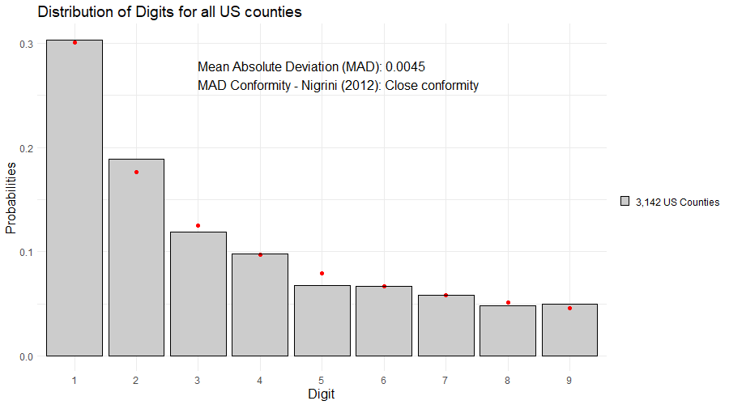
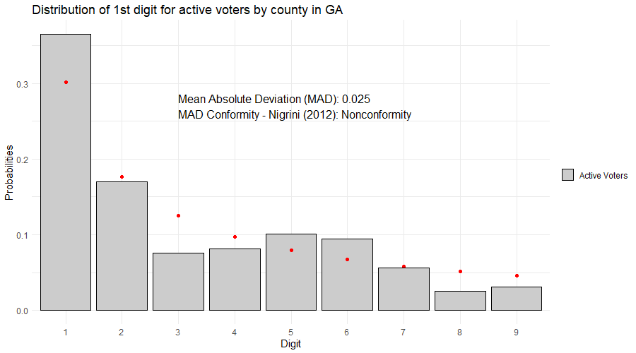
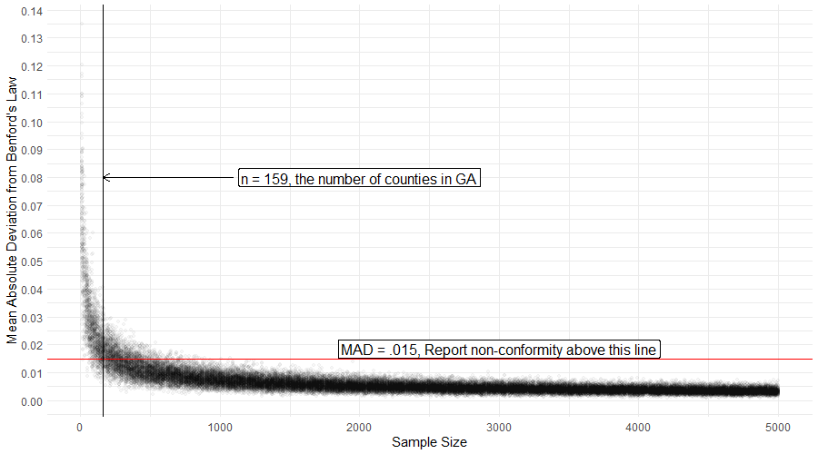
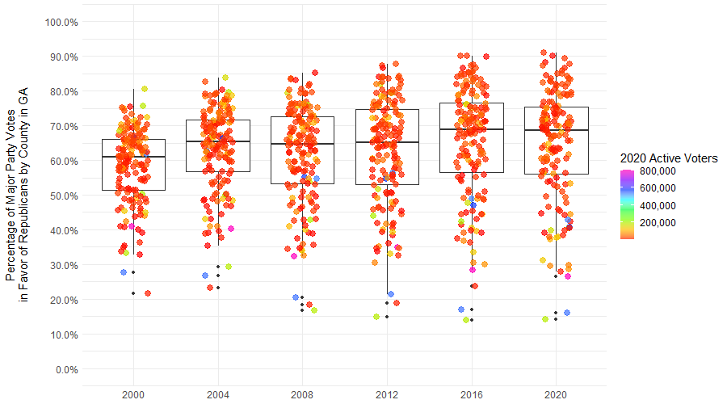

```{r setup, include=FALSE}
#knitr::opts_chunk$set(echo = TRUE)

## yes, this code is horrid...but i'm not refactoring it or cleaning it up....i'm so sorry. 

rm(list = ls())
library(benford.analysis)
library(BeyondBenford)
library(shiny)
library(shinyWidgets)
library(shinydashboard)
library(plotly)
library(openxlsx)
#library(ggpubr)
library(ggplot2)
suppressPackageStartupMessages(library(tidyverse))
library(plyr)
library(triangle)
library(foreach)
library(doParallel)
library(Cairo)
options(shiny.usecairo=T)

source('dig.distjd.R') ## i made minor modifications to the data output in this function from the BeyondBenford package. 


presdata <- readRDS('presdata.RDS')


```

## Why am I Here?
Robert Bonavito, CPA, MBA, PFS, CVA, ABV, CFE, CFF, CGMA posted a video comparing the distribution of the first digit of the vote totals in GA counties to the expectation from Benford's Law <https://youtu.be/DoF3WS42w3M?t=573> and states the results are "...pointing to massive fraud". That video has been viewed almost 100,000 times as of Nov 22. But do the data really indicate massive fraud? 

***The short answer is no because even if the data look very strange indeed, we can't infer any specific mechanism for why they look strange from the result alone. *** Bonavito didn't perform any statistical procedures to test for non-conformance (on video) which seems insufficient. I performed these procedures (Mean Absolute Deviation, Chi Square, Mantissa Arc tests); results are mixed. But even if there was strong statistical evidence of non-conformance, it would only be evidence that the data don't conform to Benford's expectations. Deviation itself provides no information about why the data deviate. Nigrini's analysis of Milwaukee County <https://youtu.be/CtmkYMYhGjU> demonstrates this well. Vote totals that do not conform to Benford's Law **may** deviate because of manipulation, but the only reason deviation **might** indicate fraud or manipulation is if the true, unadulterated vote totals do conform to Benford's Law. Frequently, they will not. 

**So the short answer may be a semantic argument, but it's an important one.**    A certified forensic accountant stating that there is evidence of massive fraud in an election is a serious matter. The seriousness of the matter may be at least partly why the video is disclaimed as for educational purposes only and that ***"if this was a litigated matter I [Bonavito] would take a different approach and have different conclusions..."***. However, his reaction to the visual results suggests he really believes there is obvious fraud indicated by these data. Part of the reason may be that he also seems to believe

>  

This was his response in the comments section to a statement questioning whether 159 was an adequate sample size. This is obviously untrue as there were only about 5 million votes cast and only about 7.2 million registered voters in GA, but the comparison to Benford's Law was for the vote totals by county for each candidate. One-hundred and fifty-nine counties means a sample size of 159 vote counts. His reaction to the data makes more sense if he really believes these results reflect millions of records. 

**So what about the long answer?** Do these results actually seem unusual? Is 159 GA counties a large enough sample size to make inferences about the validity of the counts using Benford's Law? Do the data actually deviate meaningfully in the first place? Is it possible to know whether the true, unadulterated vote totals conform to the expectation or not? Is there really any evidence of fraud here? This document examines these questions and illustrates why the results in the video are not meaningful and do not support the assertion that the data indicate massive fraud.

## Benford's Law

Bonavito describes Benford's Law in the video, and many other sources are available that do the same, so I won't spend much time on it here, but it basically describes specific digit frequency distributions in certain types of data sets or number processes (i.e. how often is the first or second digit of all the data a 1,2,3... etc.). Population data frequently conform to Benford's Law, which may be why it can be useful in detecting election fraud, since vote totals are in some way functions of population data in each county or precinct.  

I downloaded county level population data from the census website (<https://www2.census.gov/programs-surveys/popest/datasets/2010-2019/counties/totals/co-est2019-alldata.csv>), and compared the 1st digit distribution
of all 3,142 US county populations or census reporting areas (from 2010 data) to the expectation from Benford's Law (indicated by the red dots). 


```{r echo = FALSE}

## download county population data from the 2010 census
#countypop = read.csv("https://www2.census.gov/programs-surveys/popest/datasets/2010-2019/counties/totals/co-est2019-alldata.csv", header = T)
# filter out columns and state aggregate data (COUNTY = 0 indicates the total state population so we don't want to include it)
#countypop_filter <- countypop %>% filter(COUNTY != 0) %>% select(c(STNAME, CTYNAME, CENSUS2010POP))
#write.csv(countypop_filter,'county_population.csv', row.names = F)

county_populations <- read.csv('county_population.csv', header = T, stringsAsFactors = F)

# county_benford <- benford(county_populations$CENSUS2010POP, number.of.digits = 1)
# 
# county_1d <- dig.distjd(county_populations$CENSUS2010POP, dig = 1, label = '3,142 US Counties', main = 'Distribution of Digits for all US counties')
# 
# png('images/benfordcounties.png', h = 500, w = 900,  units = 'px',pointsize = 8)
# 
# county_1d$graph + annotate('text', x=3, y = .27, label = paste0('Mean Absolute Deviation (MAD): ', round(county_benford$MAD, 4), '\n', 'MAD Conformity - Nigrini (2012): ', county_benford$MAD.conformity, sep = ''), hjust = 0, size = 5.5)  + theme(text = element_text(size = 15.5))
# 
# 
# dev.off()


```



Mmmmmm, lovely. Nigrini (2012) suggests the Mean Absolute Deviation between the observed and expected digit frequencies to assess conformance or non-conformance. (See "Benford's Law: Applications for Forensic Accounting, Auditing, and Fraud Detection"). The text in the graph indicates the distribution of 1st digits for US county populations has a MAD that Nigrini classifies as "Close conformity". Values above .015 indicate non-conformity based his guidelines for interpretation.

## Are the Results in GA Actually Unusual or Unexpected?
The results above for all counties across the U.S. were a good fit for Benford's Law, but what if we look the distribution of county populations in GA? Or any other state? Almost none of them conform to the expectation from Benford's Law according to the MAD criteria (Texas, Tennessee, and Missouri do). 
This does not mean they are fraudulent or manipulated (that we know of). It only means that the distribution of the 1st digits 
of populations for smaller subsets of counties in the U.S. do not converge to Benford's Law enough to appear as a good match or meet certain acceptability criteria. The red dots indicate the expected values.  

```{r  echo=F}
options(shiny.usecairo=F)


inputPanel(
  
  pickerInput('selectstate', choices = unique(county_populations$STNAME[county_populations$STNAME != 'District of Columbia']), selected = 'Georgia', multiple = F)

)

renderPlotly( {
dat <- county_populations %>% filter(STNAME == input$selectstate)
scounty_benford <- benford(dat$CENSUS2010POP, number.of.digits = 1)
p <- dig.distjd(dat$CENSUS2010POP, dig = 1, main = paste('Distribution of 1st digits for county populations in', input$selectstate), label = paste(dim(dat)[1], input$selectstate, 'Counties'))


# p$graph + annotate('text', x=5, y = .27, label = paste0('Mean Absolute Deviation (MAD): ', round(scounty_benford$MAD, 4), '\n', 'MAD Conformity - Nigrini (2012): ', scounty_benford$MAD.conformity, sep = ''), hjust = 0, size = 3.5) + theme(text = element_text(size = 10))

stat <- data.frame(xx =5.5, yy = max(max(scounty_benford$bfd$data.dist)*.8, .27), lab = paste0('Mean Absolute Deviation (MAD): ', round(scounty_benford$MAD, 4), '<br>', 'MAD Conformity - Nigrini (2012): ', scounty_benford$MAD.conformity, sep = ''))

stat <- list(   x = stat$xx,   y = stat$yy,   text = stat$lab,   align = 'left',   font = list(size =14),   xref = "x",   yref = "y",
  showarrow = F)

y <- list(title = "Probabilities" )

x <- list(  title = "Digit")

plot_ly(data = scounty_benford$bfd, type = 'bar', marker = list(color = "lightgrey", line = list(color = 'black',width = .7)) ) %>% 
  add_trace(x = ~digits, y = ~data.dist, name =  paste(dim(dat)[1], input$selectstate, 'Counties')) %>% 
  add_markers(x= ~digits, y = ~benford.dist, name = 'Benford', marker = list(color = "red")) %>% 
  layout(legend = list(x= 1, y = 0.5), annotations = stat, xaxis = x, yaxis = y, bargap = 0.1)


})


# generateImage = function(dat, state) {
#   outfile = tempfile(fileext = '.png')
#   scounty_benford <- benford(dat$CENSUS2010POP, number.of.digits = 1)
#   p <- dig.distjd(dat$CENSUS2010POP, dig = 1, main = paste('Distribution of 1st digits for county populations in', state), label = paste(dim(dat)[1],           state, 'Counties')) 
#   
#   png(outfile, h = 400, w = 910, units = 'px')
#  
#   print(p$graph + annotate('text', x=4, y = .27, label = paste0('Mean Absolute Deviation (MAD): ', round(scounty_benford$MAD, 4), '\n', 'MAD Conformity - Nigrini (2012): ',     scounty_benford$MAD.conformity, sep = ''), hjust = 0, size = 5.5) + theme(text = element_text(size = 15))
# )
#   dev.off()
#   list(src = outfile)
# }
# 
# renderImage({
#   generateImage(dat = county_populations %>% filter(STNAME == input$selectstate), state = input$selectstate)
#   
# }, deleteFile = F, outputArgs = list(width = 910, height = 400))
# 


```

OK, but those are populations, which are not the same as votes. So I thought of looking at the number of active voters by county in GA (<https://sos.ga.gov/admin/uploads/Active_Voters_by_Race_Gender_as_of_November_1_2020.xlsx>). These also do not conform to the expectations of Benford's Law according to the MAD measure. Is all of this nefarious? There isn't any reason in these data to think so because with sample sizes equal to the number of counties, these results are not particularly unusual. The experiment described in the next paragraph illustrates why. 


```{r, echo=F}
# GA_activevoters <- read.xlsx("https://sos.ga.gov/admin/uploads/Active_Voters_by_Race_Gender_as_of_November_1_2020.xlsx", sheet = 'ACT_VOTERSBY_RACE_AND_GENDER', rows = 9:168, )
# GA_activevoters$TOTAL.VOTERS <- as.integer(GA_activevoters$TOTAL.VOTERS)
# write.xlsx(GA_activevoters, 'GA_Voters.xlsx')
# 
 GA_activevoters <-read.xlsx('GA_Voters.xlsx')
# 
GA_voters_benford <-benford(GA_activevoters$TOTAL.VOTERS, number.of.digits = 1)
p <- dig.distjd(GA_activevoters$TOTAL.VOTERS, dig = 1, main = 'Distribution of 1st digit for active voters by county in GA', label = 'Active Voters')
# 
# png('images/benfordactivevoters.png', h = 500, w = 900, units = 'px')
# p$graph + annotate('text', x=3, y = .27, label = paste0('Mean Absolute Deviation (MAD): ', round(GA_voters_benford$MAD, 4), '\n', 'MAD Conformity - Nigrini (2012): ', GA_voters_benford$MAD.conformity, sep = ''), hjust = 0, size = 5.5) + theme(text = element_text(size = 15))
# 
# dev.off()

```





```{css, echo=FALSE}
.shiny-flow-layout>div {
  display: inline-block;
  vertical-align: top;
  padding-right: 12px;
  width: 900px;}
```

Suppose we randomly generate some data known to perfectly converge to Benford's Law and compare the 1st digit distributions to the expected values for various sample sizes. I'm generating such data by multiplying 10 independent random variables of different distributions and magnitudes together. I've selected a sample size of 5,000 (mmmmm, lovely). Every time this document loads or the slider bar is moved, it generates a new sample, but I'm certain that it's showing a nice fit with close conformity. What if we try a sample size of 159? Move the slider to generate a new data set of the specified sample size (after clicking the slider bar, the <- -> arrow keys it move up or down by 1). 

Sample sizes of about 160 result in a data set that achieves conformance according to the MAD criteria only about a quarter of the time. You should only need to generate 5-10 samples of this size to find one that looks particularly goofy. Samples larger than about 1500 almost universally report close conformance. Bonavito performed the same procedure in Pennsylvania (67 counties). Try a few samples around 67.     

``` {r echo = F}

inputPanel(
  
 sliderInput('samplesize', label = 'Specify Sample Size', min = 10, max = 5000, step = 1, value = 5000 ,width = '800px' )
  
)
  

renderPlotly({
  
Bdat <-data.frame(A = runif(input$samplesize, 0 , 100000), B = runif(input$samplesize), C = rpois(input$samplesize,300), D = rexp(input$samplesize,1/200), 
E = rnorm(input$samplesize,100000, 1000), FF = exp(runif(input$samplesize,0, 100)), G = 2^runif(input$samplesize,0, 30), H = runif(input$samplesize,0,100), I = rnbinom(input$samplesize,5, .3), J = rgamma(input$samplesize,2.4, 5))
  
Bdat$Benford <- apply(Bdat, 1, prod)
BenfordPerfect <- benford(Bdat$Benford, number.of.digits = 1)
  

#p <- dig.distjd(Bdat$Benford , label = paste0('Product of 10 RV\n(n = ', input$samplesize, ')' ))  

# p$graph  + annotate('text', x=3, y = .27, label = paste0('Mean Absolute Deviation (MAD): ', round(BenfordPerfect$MAD, 4), '\n', 'MAD Conformity - Nigrini (2012): ', BenfordPerfect$MAD.conformity, sep = ''), hjust = 0, size = 5.5) +theme(text = element_text(size = 16))


stat <- data.frame(xx =5.5, yy = max(max(BenfordPerfect$bfd$data.dist)*.8, .27), lab = paste0('Mean Absolute Deviation (MAD): ', round(BenfordPerfect$MAD, 4), '<br>', 'MAD Conformity - Nigrini (2012): ', BenfordPerfect$MAD.conformity, sep = ''))

stat <- list(   x = stat$xx,   y = stat$yy,   text = stat$lab,   align = 'left',   font = list(size =14),   xref = "x",   yref = "y",
  showarrow = F)

y <- list(title = "Probabilities" )

x <- list(  title = "Digit")

plot_ly(data = BenfordPerfect$bfd, type = 'bar', marker = list(color = "lightgrey", line = list(color = 'black',width = .7)) ) %>% 
  add_trace(x = ~digits, y = ~data.dist, name =  paste0('Product of 10 RV\n(n = ', input$samplesize, ')' )) %>% 
  add_markers(x= ~digits, y = ~benford.dist, name = 'Benford', marker = list(color = "red")) %>% 
  layout(legend = list(x= 1, y = 0.5), annotations = stat, xaxis = x, yaxis = y, bargap = 0.1)


})

```

Just for fun I generated 100 independent sets of the data described above (product of 10 random variables) for each sample size ranging from 10 to 5000 in steps of 10 (i.e. I generated 100 independent samples with 10 data points in each, and 100 independent samples with 20 data points in each etc.). For each sample I calculated the 1st digit distributions and the MAD with respect to Benford's Law, and then plotted the resulting MADs for each sample size below.  The plot below shows the distribution of MAD at each sample size. Georgia comprises 159 counties. So even if we are examining a number process that perfectly converges to Benford's Law, a sample size of 159 will frequently appear as non-conforming. The 2020 election results are indicated in the graph, and we discuss them specifically in the next section. 


```{r echo=F}
# library(foreach)
# library(doParallel)
# 
## This takes about 5 minutes to run on 8 cores. 
# 
# cl <-makeCluster(8)
# registerDoParallel(cl)
# 
# MAD <- foreach(i = seq(10, 5000, 10), .combine = rbind, .packages = c('foreach', 'benford.analysis')) %dopar% {
# 
#   inside <- foreach (j = 1:100, .combine = rbind) %do% {
# 
#     Bdat <-data.frame(A = runif(i, 0, 100000), B = runif(i), C = rpois(i, 300), D = rexp(i, 1/200), E = rnorm(i, 100000, 1000),
#                       FF = exp(runif(i, 0, 100)), G = 2^runif(i, 0, 30), H = runif(i, 0,100), I = rnbinom(i, 5, .3), J = rgamma(i, 2.4, 5))
# 
#     Bdat$Benford <- apply(Bdat, 1, prod)
#     BenfordPerfect <- benford(Bdat$Benford, number.of.digits = 1)
# 
#     data.frame(n = i, MAD = BenfordPerfect$MAD)
# 
#   }
# 
# }
# 
# stopCluster(cl)
# 
# write.csv(MAD, 'MAD.csv', row.names = F)
# 

MADdat <- read.csv('MAD.csv')
# 
# png('images/mad.png', h = 500, w = 900, units = 'px')
# 
# ggplot(data = MADdat, aes(x = n, y = MAD)) + geom_point(alpha = .03 ) + geom_hline(yintercept = .015, colour = 'red') + xlab('Sample Size') + ylab("Mean Absolute Deviation from Benford's Law") +
#   geom_vline(xintercept =  159) + theme_minimal() +
#   annotate('label',x = 3000, y = .0185, label = 'MAD = .015, Report non-conformity above this line', size = 5.5) +
#   annotate('label', x = 2000, y = .11, label = 'n = 159, the number of counties in GA', size = 5.5) +
#   annotate('segment', x = 1100, y = .11, xend = 159, yend = .11, arrow = arrow(length = unit(0.02, "npc") )) + 
#   annotate('segment', x = 1000, y = .06, xend = 159, yend = .026, colour = 'red' ) + 
#   annotate('label',x = 1100, y = .06, label = 'Biden 2020 GA MAD') +
#    annotate('segment', x = 1400, y = .045, yend = .0237, xend = 159, colour = 'red') +
#   annotate('label', x = 1400, y = .045, label = 'Trump 2020 GA MAD') +
#  
#   theme(text = element_text(size = 15)) + scale_y_continuous(breaks = seq(0, .2, .01))
# 
# dev.off()

```


So what does all this mean? It means that the 1st digit distributions of state populations by county generally do not conform to Benford's law. The 1st digit distribution of the number of active voters by county in GA (as of Nov 1, 2020) do not conform to Benford's Law. Randomly generated data that is demonstrated to converge to Benford's Law does not conform to Benford's Law with sample sizes commensurate with the number of counties in GA about three quarters of the time. Since vote counts by county are by necessity a function of the populations and number of registered voters in each county, and the sample size is by necessity the number of counties, it's not unexpected that vote counts for candidates in GA also do not conform to Benford's Law. But speaking of vote counts...


```{r echo=F}

data2020 <- read.csv('2020GA.csv', stringsAsFactors = F)


#Bid<- digit.distr(data2020$BIDEN.VOTES, dig = 1, main = "Comparison of Benford's Law to Biden Votes (159 counties)", label = 'Biden' )
BidBenford <- benford(data2020$BIDEN.VOTES, number.of.digits = 1)
#Tru<- digit.distr(data2020$TRUMP.VOTES, dig = 1, main = "Comparison of Benford's Law to Trump Votes (159 counties)", label = 'Trump' )
TruBenford <- benford(data2020$TRUMP.VOTES, number.of.digits = 1)

######################


# BTdat <- rbind(subset(Bid$data , Distribution == 'Biden'), subset(Tru$data, Distribution == 'Trump'))
# 
# statsBid <-  data.frame(Distribution = 'Biden', label = paste0('Mean Absolute Deviation (MAD): ', round(BidBenford$MAD, 4), '\n', 'MAD Conformity - Nigrini (2012): ', BidBenford$MAD.conformity, sep = ''))
# 
# statsTru <- data.frame(Distribution = 'Trump', label = paste0('Mean Absolute Deviation (MAD): ', round(TruBenford$MAD, 4), '\n', 'MAD Conformity - Nigrini (2012): ', TruBenford$MAD.conformity, sep = ''))
# 
# stats <- rbind(statsBid, statsTru)
# stats$x <- 3
# stats$y <- .22
# 
# btab <- subset(Bid$data, Distribution == 'Benford')
# 
# png('images/GA2020.png', h = 500, w = 900,  units = 'px')
# ggplot(BTdat, aes(x = Digit, y = Freq.Prob) ) +
#       geom_bar(stat = "identity", color = "black", position = position_dodge(), fill = 'grey80') + facet_grid(.~Distribution) +
#   annotate('point', x = btab$Digit, y = btab$Freq.Prob, colour = 'red', size = 2) +
#       labs(title = '2020 GA Election 1st Digit Distributions', x = "Digit", y = "Probabilities") +
#   theme(legend.title = element_blank(), panel.background = element_rect(fill = 'white'), panel.grid = element_line(colour = 'grey90')) + geom_text(data = stats, aes(x = x, y = y, label = label), size = 4, hjust = 0) + theme(text = element_text(size = 15))
# 
# dev.off()

```

## Examining the Vote Tallys in GA
I downloaded the same data for vote totals by county from Politico as Bonavito, but my download was a few days later, so the results are not exactly the same, but close enough to reproduce what he describes in the video. The plots are below. Both vote tallies report non-conformance according to Nigrini's proposed MAD criteria. The MAD for both vote tallies fall within the range of those generated from samples of 160 pulled from a number process that *perfectly converges to Benford's Law*. In the data above, MAD for samples of 160 were as high as `r max(MADdat$MAD[MADdat$n == 160])`; `r length(MADdat$MAD[MADdat$n == 160 & MADdat$MAD > .026])` were greater than Biden's 2020 result and `r length(MADdat$MAD[MADdat$n == 160 & MADdat$MAD > .0237])` were greater than Trump's result). Those are a bit on the high side but if we thought of .14 and .18 as empirically derived p-values, they would not generally constitute statistical evidence that the GA election results deviated from a number process that perfectly converged to Benford's Law. But they are a little unusual compared to a perfectly converging manufactured number process, and since we all have lot's of free time why not compare to previous elections or elections in other states? Missouri, Tennessee and Texas had county populations that achieved conformity; what do their distributions look like? (Spoiler: Texas is the only result that looks good; does this mean the election officials in Texas are superior to those in Tennessee or Missouri or is it because Texas has 254 counties and is thus much more likely to get a result that conforms to expectations compared to a result with 115 or 95 counties?)


```{r echo=FALSE}
inputPanel(

    fluidRow(column(width = 4,  pickerInput('selectstate2', choices = unique(presdata$state[presdata$state != 'District of Columbia']), selected = 'Georgia', multiple = F)), 
           column(width = 4, pickerInput('selectyear', choices = unique(presdata$year), selected = 2020)))
    
)


renderPlot({
dat2_rep <- presdata %>% filter(state == input$selectstate2 & year == input$selectyear & party == 'republican')
dat2_dem <- presdata %>% filter(state == input$selectstate2 & year == input$selectyear & party == 'democrat')

dembenford <- benford(dat2_dem$candidatevotes, number.of.digits = 1)
dembenford$bfd$label <- 'Democrat'
demmad <- data.frame(stats = paste0('Mean Absolute Deviation (MAD): ', round(dembenford$MAD, 4), '\n', 'MAD Conformity - Nigrini (2012): ', dembenford$MAD.conformity), xx = 3, yy = .35, label = 'Democrat')
                     
                     
repbenford <- benford(dat2_rep$candidatevotes, number.of.digits = 1)
repbenford$bfd$label  <- 'Republican'
repmad <- data.frame(stats = paste0('Mean Absolute Deviation (MAD): ', round(repbenford$MAD, 4), '\n', 'MAD Conformity - Nigrini (2012): ', repbenford$MAD.conformity), xx = 3, yy = .35, label = 'Republican')


dat_rd <- rbind(dembenford$bfd, repbenford$bfd)
dat_rd$digits <- as.integer(dat_rd$digits)
dat_MAD <-rbind(repmad, demmad)

ggplot(dat_rd, aes(x = digits, y = data.dist)) + geom_bar(stat = 'identity', fill = 'grey80') + facet_grid(.~label) + ylab('Probabilities') + xlab(NULL) + scale_x_continuous(breaks = 1:9) + theme(panel.background = element_blank(), panel.grid =  element_line(colour = 'grey94'), text = element_text(size = 16))  + geom_text(data = dat_MAD, aes(x = xx, y = yy, label = stats), hjust = 0) + geom_point(aes(y = benford.dist), colour = 'red', size = 3)


})

```


The panel above includes by county presidential election data from <https://dataverse.harvard.edu/dataset.xhtml?persistentId=doi:10.7910/DVN/VOQCHQ>. No vote tallies for either party's candidate conform to expectations based on MAD criteria in GA for data going back to 2000. Democrat MAD is generally higher than Republican MAD (in GA). Democrat MAD seems to be decreasing since 2000 and Republican MAD seems to be increasing since 2000. Are these indications of massive fraud in every election going back to 2000? Are Democrats becoming less fraudulent while Republicans are becoming more fraudulent? I think it's more likely that they are all simply the results of a sample size of 159, non-homogeneous vote splits (rural vs urban counties), the distribution of the number of voters in each county, and changes in the vote split trends since 2000. The next section examines these trends


### Underyling data structures and trends in GA

The distribution of the percentage of the votes each candidate receives by county is important as these directly influence the first digit frequencies. The chart below plots the percentage of votes by county cast in favor of Republican candidates in each election in GA going back to 2000. The color scale indicates the number of registered voters in the county as of 2020. The data demonstrate diverging party preference between counties. Each dot represents a county. The boxes behind the dots indicate the central 50% of observations, with the line in the center of the box indicating the median value.  

```{r echo=F}
suppressPackageStartupMessages(library(scales))

GApresdata <- subset(presdata, state == 'Georgia')[, c('year', 'state', 'county', 'party', 'totalvotes', 'candidatevotes')]
GApresdata_w <- pivot_wider(GApresdata, values_from = candidatevotes, names_from = party)

presdata_w <- pivot_wider(presdata[, c('state', 'year', 'county', 'party', 'totalvotes', 'candidatevotes')], values_from = candidatevotes, names_from = party)


## totalvotes includes otherparties...since those aren't in the 2020data, recraft these to be just of Rep/Dem votes
GApresdata_w$totalvotes <- GApresdata_w$democrat + GApresdata_w$republican


## reshape 2020 data
GA2020_w <- data.frame(county = tolower(gsub(" County", "\\", data2020$COUNTY)), year = 2020, totalvotes = as.integer(gsub(',', '\\', data2020$Total_Votes)), democrat = data2020$BIDEN.VOTES , republican = data2020$TRUMP.VOTES, state = 'Georgia')


GApresdata_w$p_republican <- GApresdata_w$republican/GApresdata_w$totalvotes
GApresdata_w$p_democrat <- GApresdata_w$democrat/GApresdata_w$totalvotes

GApresdata_w$totalvotes <- GApresdata_w$democrat + GApresdata_w$republican
GA2020_w$p_republican <- GA2020_w$republican/GA2020_w$totalvotes
GA2020_w$p_democrat <- GA2020_w$democrat/GA2020_w$totalvotes


GA_activevoters$county <- tolower(GA_activevoters$COUNTY.NAME)
GApresdata_w <- merge(GApresdata_w, GA_activevoters[,c('county', "TOTAL.VOTERS")])
# 
# png('images/votesplits.png', h = 500,w = 900, units = 'px')
# ggplot(GApresdata_w, aes(x = factor(year), y = p_republican, colour = TOTAL.VOTERS)) + geom_boxplot() + geom_jitter(width = .18, size = 3.2) + scale_y_continuous(label = percent, breaks = seq(0,1, .1), limits = c(0,1)) + ylab("Percentage of Major Party Votes\nin Favor of Republicans by County in GA\n ") + scale_color_gradientn(colours = rainbow(8, alpha = .7), labels = comma) + labs(colour = '2020 Active Voters') + xlab(NULL) + theme_minimal() + theme(text = element_text(size = 15))
# dev.off()

```

Another way to look at these data is to examine the frequency distribution of the number of counties in which candidates receive some percentage of the votes. This structure fundamentally influences the 1st digit distribution. The chart below illustrates that distribution for Republican and Democrat candidates in the selected year partitioned by the number of registered voters in the counties. The most stark divisions are in counties with over 200K registered voters or less than 10K registered voters. In 2000 the vote splits in the very large or very small counties were about even (approximately centered on 50%, similar distributions of vote splits). 

The distributions have changed significantly since 2000. Compare 2000 to 2020 for counties larger than 200K voters and smaller than 10K voters.The change has been gradually occurring over the last 20 years. The bars show 2% bins (i.e. the bar indicates the number of counties in each population band where a party received 0-2% of the votes, 2-4% of the votes etc.).  

```{css, echo=FALSE}
.shiny-input-container:not(.shiny-input-container-inline) {
  width: 600px;
  max-width: 100%;
}
```


```{r echo=F}

inputPanel(
 fluidRow(
  column(width = 2, pickerInput('selectyear2', label = 'Select Year', choices = sort(unique(GApresdata_w$year)), selected = 2000)), 

  column(width = 10, sliderInput('selectsize', label = 'Partition on County Size',  value = 200000 ,min = 2000, max = 200000, step = 1000))
)

)

GApresdata_p_L <- pivot_longer(GApresdata_w, cols = c(p_democrat, p_republican), names_to = 'party', values_to = 'PVotes')


renderPlot({ 
votedist <- subset(GApresdata_p_L, year == input$selectyear2)
votedist$Party <- 'Republican'
votedist$Party[votedist$party == 'p_democrat' ] <- 'Democrat'
votedist$CountySize <- paste('<', input$selectsize, 'voters')
votedist$CountySize[votedist$TOTAL.VOTERS > input$selectsize] <- paste('>', input$selectsize, 'voters')

ggplot(votedist, aes(x = PVotes)) + geom_histogram(fill = 'grey80', colour = 'grey50', binwidth = .02, boundary = 0) + facet_grid(Party~CountySize) + ylab('Number of Counties') + xlab('Proportion of Votes Recieved')  + theme(text = element_text(size = 15), panel.background = element_blank(), panel.grid = element_line(colour = 'grey94')) + scale_x_continuous(breaks = seq(0, 1, 0.2), limits = c(0,1), label = percent) + scale_y_continuous(limits = c(0,20))


})


```

### Do the data structures and trends above influence the 1st digit distributions?
To determine the impact of the size of the counties and the vote splits, I simulated 1,000 elections in two different ways. 
The first way examines random elections with with vote splits for each county uniformly selected between 35% and 65% (Random Vote Split).

For each random election I computed the 1st digit distributions of the vote totals by county and calculated the distribution of MAD in each year from 2000-2020. The procedure for the first experiment is as follows:

**Random Vote Splits**

* In each year 
  - Simulate varying turnout by randomly sampling an integer within $\pm$ 5% of the total votes cast in each county.     
  - Assign the simulated Democrat a randomly sampled proportion of the turnout between 35% and 65%. 
  - Assign the simulated Republican the remainder of the votes in that county.
  - Compute the 1st digit distributions and calculate MAD for simulated Democrat and simulated Republican. 
* Repeat the above process 1,000 times to generate 1,000 random elections

The second way directly reflects the historical elections and reflects similar turnouts and vote splits but randomly generates the actual number of votes in each county. So while some may say the votes splits may have been the result of fraud in the first place, this experiment examines what fair elections would look like with the historical totals and vote splits (fair because actual turnout and vote counts are random numbers that conform to the constraints of the procedure below). The procedure is as follows:

**Historical Vote Splits**

* In each year 
  - Simulate varying turnout by randomly sampling an integer within $\pm$ 5% of the total votes cast in each county.     
  - Assign the simulated Democrat a randomly sampled percentage of the turnout within $\pm$ 5 percentage points of the recorded percentage of Democrat votes.
  - Assign the simulated Republican the remainder of the votes in that county.
  - Compute the 1st digit distributions and calculate MAD for simulated Democrat and simulated Republican. 
* Repeat the above process 1,000 times to generate 1,000 random elections with the approximate vote splits by county as in historical elections.

The plot below illustrates the distribution of the MAD scores for each experiment. The black vertical line indicates the MAD acceptability criteria of 0.015 (values less than this number are acceptable as conforming to Benford's Law). The red vertical lines indicate the historical MADs for the actual election results. 


```{r echo=F}

# cl <-makeCluster(8)
# registerDoParallel(cl)
# 
# Simdat <-foreach(y = c(2000,2004,2008,2012,2016, 2020),  .packages = c('foreach', 'benford.analysis')) %dopar% {
# 
# dat <- subset(GApresdata_w, year == y)
# 
# ySimdat <- foreach(i = 1:1000) %do% {
# 
#   dat$turnout <- round(runif(159, .95, 1.05)*dat$totalvotes,0)
#   dat$repnum <- i
#   dat$sim_democrat <- round(runif(159, dat$p_democrat - .05, dat$p_democrat + .05)*dat$turnout, 0)
#   dat$sim_republican <- dat$turnout - dat$sim_democrat
#   dat$randomA <- round(dat$turnout*runif(159, .35, .65), 0)
#   dat$randomB <- dat$turnout - dat$randomA
#   dat$D1 <-  as.integer(strtrim(as.character(dat$democrat), 1))
#   dat$SD1 <-  as.integer(strtrim(as.character(dat$sim_democrat), 1))
#   dat$R1 <-  as.integer(strtrim(as.character(dat$republican), 1))
#   dat$SR1 <-  as.integer(strtrim(as.character(dat$sim_republican), 1))
#   
#   simdemBen <- benford(dat$sim_democrat, number.of.digits = 1)
#   simrepBen <- benford(dat$sim_republican, number.of.digits = 1)
#   ranABen <- benford(dat$randomA, number.of.digits = 1)
#   randBBen <- benford(dat$randomB, number.of.digits = 1)
# 
# 
#   Dstats <-data.frame(MAD = simdemBen$MAD,  stats = paste0('Mean Absolute Deviation (MAD): ', round(simdemBen$MAD, 4), '\n', 'MAD Conformity - Nigrini (2012): ', simdemBen$MAD.conformity), xx = 3, yy = .35, label = 'sim_democrat', Model = paste(y, 'Vote Splits'))
# 
#   Rstats <-data.frame(MAD = simrepBen$MAD, stats = paste0('Mean Absolute Deviation (MAD): ', round(simrepBen$MAD, 4), '\n', 'MAD Conformity - Nigrini (2012): ', simrepBen$MAD.conformity), xx = 3, yy = .35, label = 'sim_republican', Model = paste(y, 'Vote Splits'))
# 
#    Astats <-data.frame(MAD = ranABen$MAD,  stats = paste0('Mean Absolute Deviation (MAD): ', round(ranABen$MAD, 4), '\n', 'MAD Conformity - Nigrini (2012): ', ranABen$MAD.conformity), xx = 3, yy = .35, label = 'Random Democrat', Model = paste(y, 'Vote Totals'))
# 
#   Bstats <-data.frame(MAD = randBBen$MAD,  stats = paste0('Mean Absolute Deviation (MAD): ', round(randBBen$MAD, 4), '\n', 'MAD Conformity - Nigrini (2012): ', randBBen$MAD.conformity), xx = 3, yy = .35, label = 'Random Republican', Model = paste(y, 'Vote Totals'))
# 
#  stats = rbind(Dstats, Rstats, Astats, Bstats)
#  stats$repnum <- i
#  list(MAD = stats, Data = dat)
# 
# }
# ySimdat
# 
# }
# 
# stopCluster(cl)
# 
# saveRDS(Simdat,'simdat.RDS')
# 
# Simdat <- readRDS('simdat.RDS')
# 
# SimMaddat <- foreach(y = 1:length(Simdat), .combine = rbind) %do% {
#   inside <- foreach(r = 1:1000, .combine = rbind) %do% {
#     Simdat[[y]][[r]]$MAD
#   }
# }
# 
# saveRDS(SimMaddat, 'SimMaddat.RDS')
# 
# Simrawdat <- foreach(y = 1:length(Simdat), .combine = rbind) %do% {
#   inside <- foreach(r = 1:1000, .combine = rbind) %do% {
#     Simdat[[y]][[r]]$Data
#   }
# }
# 
# saveRDS(Simrawdat, 'Simrawdat.RDS')


######
SimMaddat <- readRDS('SimMaddat.RDS')
Simrawdat <- readRDS('Simrawdat.RDS')

SimMaddat$label[SimMaddat$label == 'sim_democrat'] <- 'Random Democrat'
SimMaddat$label[SimMaddat$label == 'sim_republican'] <- 'Random Republican'
SimMaddat$Votesplit <- 'Random Vote Split'
SimMaddat$Votesplit[sapply(SimMaddat$Model, grepl, pattern = 'Split') == T] <- 'Historical Vote Split' 
SimMaddat$Model <- gsub('Splits', 'Totals',  SimMaddat$Model)

### compile the data from previous GA elections to plot over histograms
historicalMAD <- foreach(y = c(2000,2004,2008,2012,2016, 2020), .combine = rbind) %do% {
  
dat2_rep <- presdata %>% filter(state == 'Georgia' & year == y & party == 'republican')
dat2_dem <- presdata %>% filter(state == 'Georgia' & year == y & party == 'democrat')

dembenford <- benford(dat2_dem$candidatevotes, number.of.digits = 1)
dembenford$bfd$label <- 'Democrat'
demmad <- data.frame(MAD =round(dembenford$MAD, 4),  xx = 3, yy = .35, label = 'Random Democrat', Model = paste(y, 'Vote Totals'))
                     
                     
repbenford <- benford(dat2_rep$candidatevotes, number.of.digits = 1)
repbenford$bfd$label  <- 'Republican'
repmad <- data.frame(MAD = round(repbenford$MAD, 4), xx = 3, yy = .35, label = 'Random Republican', Model = paste(y, 'Vote Totals'))

dat_MAD <-rbind(repmad, demmad)

}

renderPlot(height = 800, {

  ggplot(SimMaddat, aes(x = MAD)) + geom_histogram(aes(fill = Votesplit) , alpha = .4, colour = 'grey50', position = 'identity') + facet_grid(Model ~ label) + geom_vline(xintercept = .015, colour = 'black')  + theme(panel.background = element_blank(), panel.grid = element_line(colour = 'grey95'), text = element_text(size = 15)) + xlab('Mean Absolute Deviation') + ylab('Observed out of 1,000') + geom_vline(data = historicalMAD, aes(xintercept = MAD), colour = 'red') + xlim(0.005,.040) 
  
  
})


```

Hmmmm....So what do we have here? 

The randomly generated fair elections where each candidate gets between 35% and 65% of the votes in each county do not conform to Benford's Law in the vast majority of the samples. **In the 2020 random simulations, `r sum(count(subset(SimMaddat, MAD <0.015 & Model == '2020 Vote Totals' & Votesplit == 'Random Vote Split'), c('Model', 'label', 'Votesplit'))$freq)` out of 2,000 calculated MADs (1000 for each candidate) conform to Benford's Law (`r round(sum(count(subset(SimMaddat, MAD <0.015 & Model == '2020 Vote Totals' & Votesplit == 'Random Vote Split'), c('Model', 'label', 'Votesplit'))$freq)*100/2000, 1)`%).** Recall the experiment with the manufactured number process that perfectly converges to Benford's Law. In that experiment approximately 25% of the data was less than 0.015 for sample sizes around 160, so we can conclude that random elections in GA do not converge to Benford's Law as quickly as a manufactured number process known to perfectly converge. We also see a decreasing trend in the MAD from the year 2000 through 2020. The distribution in 2000 is centered on about 0.025 and the distribution from 2020 is centered on about 0.020 for both "parties". The only fundamental variation year over year in Random Vote Split result is the total number of votes in each county. So we can confidently state the sizes of the counties has some influence over 1st digit distributions when the vote splits are uniformly random and symmetric across the all the counties. 

The simulation of Historical Vote splits is more interesting. The Random Democrat MAD starts much higher in 2000 while the Random Republican MAD is lower. The historical MAD generally follow the simulation results. Both parties seem to be converging with the results of the Random Vote Split model, which is curious and I don't know why, but since it's not important for our investigation I'm not going to spend time pondering. More importantly, **in the 2020 historical vote split simulations `r sum(count(subset(SimMaddat, MAD <0.015 & Model == '2020 Vote Totals' & Votesplit == 'Historical Vote Split'), c('Model', 'label', 'Votesplit'))$freq)` out of 2,000 calculated MADs (1000 for each candidate) conform to Benford's Law  (`r round(sum(count(subset(SimMaddat, MAD <0.015 & Model == '2020 Vote Totals' & Votesplit == 'Historical Vote Split'), c('Model', 'label', 'Votesplit'))$freq)*100/2000, 1)`%).** So we have similar conclusions about how the GA by county vote totals converge toward Benford's Law when accounting for historical vote splits. The only fundamental difference between each simulation run is the total number of votes cast in each county and the mean percentage of votes in each county that go to each party. **So for vote counts of the same sample size, the distribution of county sizes and vote splits between the candidates in each county significantly influence the first digit distributions of the county vote totals and conformance with expectations from Benford's Law.** 

Another result of this simulation exercise is that historical MAD always fell within the distribution of the simulation of fair elections. That isn't particularly insightful since the simulation is centered around the historical elections themselves, but it does demonstrate that **for fair elections that look similar to the actual election in terms of vote splits and turnout, the observed election results are completely plausible**. However...

It is unusual to me that the simulation results are not always centered on the historical MAD, since the means of the simulations were based on the actual election results in each year. To satisfy my curiosity, we need to examine the individual county 1st digit differences between the historical election result the the most common simulation results and determine if those differences are plausible or explainable by the data structure. Let's compare 1st digit results from simulated elections that resulted in MAD between 0.018 and 0.022 since that seems to be most likely outcome in the simulation results for Democrat MAD in the 2020 simulation (recall the Biden data scored MAD of 0.026)

The panel below includes only simulation replications with MAD between 0.018 and 0.022. Selecting a replication shows the simulated 1st digit of the vote count in each county (the colored block) compared to the 1st digit of the vote count for Biden in the 2020 election (the black dot). The bars are colored to indicate if the election had more votes for Biden or Trump than the simulation. The chart only shows counties where the 1st digit is different between the simulation and the actual election result. The differences appear completely random. About half the differences are in favor of Trump (fewer simulated Biden votes than the election result) and about half are in favor of Biden. Trump and Biden each win the simulated elections about half of the time which is as expected since the model was $\pm$ 5% of the actual election, and the actual election was basically even.  

```{r echo=F}
likely2020 <- subset(SimMaddat, label == 'Random Democrat' & Model == '2020 Vote Totals' & Votesplit == 'Historical Vote Split' & MAD >0.018 & MAD <0.022)

likely2020R <- subset(SimMaddat, label == 'Random Republican' & Model == '2020 Vote Totals' & Votesplit == 'Historical Vote Split' & MAD >0.018 & MAD <0.022)

likely2020raw <- subset(Simrawdat, repnum %in% likely2020$repnum & year == 2020)
likely2020raw$BDif <- likely2020raw$democrat - likely2020raw$sim_democrat
likely2020raw$Gain <- 'Biden Gain'
likely2020raw$Gain[likely2020raw$BDif < 0 ] <- 'Trump Gain'

likely2020Rraw <- subset(Simrawdat, repnum %in% likely2020R$repnum & year == 2020)


inputPanel({
  
  pickerInput('repnum', choices = unique(likely2020raw$repnum))
  
})

renderPlot( height = 900, {

  c_dat <- subset(likely2020raw, repnum == input$repnum & D1 != SD1)  
  
  TotalBiden <- sum(subset(likely2020raw, repnum == input$repnum)$sim_democrat)
  TotalTrump <- sum(subset(likely2020raw, repnum == input$repnum)$sim_republican)
  win <- 'Trump' 
  if(TotalBiden > TotalTrump) win <- 'Biden'              
  
c <- ggplot(c_dat, aes(x = SD1,y = county)) + geom_tile(aes(fill = Gain)) + scale_x_continuous(breaks = 1:9) + geom_point(colour = 'black', size = 3,aes(x = D1)) + labs(title = 'Black dot indicates actual 2020 Biden 1st digit in each county', x = '1st Digit of Vote Count', subtitle = paste0('Simulated Trump Votes: ', TotalTrump, '; Simulated Biden Votes: ', TotalBiden, ' (Winner: ', win,')' )) + scale_fill_manual(name = 'Election Result\nCompared to Simulation', values = c('blue', 'red')) + theme(text = element_text(size = 14), axis.text.y = element_text(size = 12))
  
c

})

## find most frequent deviations. 
likely2020hmap <- count(subset(likely2020raw, D1 != SD1), c('county', 'totalvotes', 'p_democrat'))
likely2020hmap <- likely2020hmap[order(likely2020hmap$freq, decreasing = T),]
likely2020hmap$cumfreq <- cumsum(likely2020hmap$freq)
likely2020hmap <- likely2020hmap[order(likely2020hmap$totalvotes, decreasing = T),]
likely2020hmap$cumfreq <- cumsum(likely2020hmap$freq)
likely2020hmap$Edemvotes <- likely2020hmap$p_democrat*likely2020hmap$totalvotes

likely2020hmapR <- count(subset(likely2020raw, R1 != SR1), c('county'))

```

The exercise above demonstrates that the difference between the 2020 election result (with MAD = 0.026) and the most commonly occurring simulated results (with MAD between 0.018 and 0.020) seem completely random (and thus do not indicate anything suspicious). If there was a pattern to the deviation of the election results and the simulated elections with closer conformity to Benford's expectations that might have indicated something nefarious.

But the historical results (seemingly for Democrats in particular) ending up on the outskirts of the range of simulation output still seems strange. I counted the number of times each county had a different 1st digit vote count from the Biden election results among the simulation runs with MAD between 0.018 and 0.020. The county that was different most frequently was Banks county. Of 386 runs with MAD between 0.018 and 0.020, the simulated 1st digit of the Biden vote count in Banks county was different than the observed election result 336 times. Banks county recorded 8,727 votes (932 for Biden, 7795 for Trump). This give us 10.68% of the vote to Biden (so the model sampled between 5.68% and 15.68% of the vote to Biden). The simulated turnout ranged from 8290 to 9163. The simulated Biden Vote counts in replications with MAD near 0.020 ranged from 479 to 1409. That's a variance of about $\pm$ 50% of the original vote total. So the simulation results in a 1st digit of the Biden vote count that's the same as the election result in only 50 out of 386 runs (13%) with MAD between 0.018 and 0.020. In retrospect my simulation design may not have been ideal, but I think it was useful to illustrate this point. 

The reason Democrat MAD is more often at the edges of the distribution of simulation results is almost certainly because there are many counties where Democrats get a much smaller percentage of the votes than Republicans. The reason this influences the centrality of the MAD from Benford's expectations is that in these counties, the variance of the actual vote counts is much larger for the Democrat than for the Republican and the number of possible 1st digits varies much more than for the Republican. Consider again Banks county. Biden's simulated vote count had first digits of 4,5,6,7,8,9,1. What about the simulated Trump votes? In the actual election result Trump received 7795 votes (89.3%). So the simulated vote split would be from 84.3% to 94.3%. The simulated vote counts for Trump where Republican MAD ranged from 0.018 to 0.020 ranged from 7,063 to 8,602 (first digit of only 7 or 8). That's only about $\pm$ 10% of the actual election vote total. The 1st digit Banks county Trump vote total was the same as the actual election result in 308 out of 402 replications with Republican MAD near 0.020. The opposite trend will appear for counties where Republicans get smaller percentages of the vote. The county where the simulated Trump 1st digit deviated from the election result most frequently was Dekalb (Trump received about 16% of the votes). 


```{r echo=F}
# I don't think i need these
# ggplot(subset(likely2020raw, county == 'banks')) + geom_histogram(aes(x = sim_democrat), binwidth = 100, boundary = 0, fill = 'grey80', colour = 'grey60') + theme_minimal() + scale_x_continuous(breaks = seq(400,1500,100)) + labs(title = 'Distribution of Banks County Biden Votes in Historical Vote Split Simulation')
# 
# ggplot(subset(likely2020Rraw, county == 'banks')) + geom_histogram(aes(x = sim_republican), binwidth = 100, boundary = 0, fill = 'grey80', colour = 'grey60') + theme_minimal() + scale_x_continuous(breaks = seq(7000, 8700, 100)) + labs(title = 'Distribution of Banks County Trump Votes in Historical Vote Split Simulation')

```


## Aggregating Election Data (is it the sample size?)
The section above was interesting and fun to develop. The structures and relationships within data sets have always fascinated me, but I want to re-examine the sample size question. Comparing the 1st digit distributions of the populations all U.S. counties to GA counties or any other state suggests 159 is not a large enough sample to expect visual conformance with Benford's Law. The Benford distribution of the number of voters by county in GA further reinforces that idea. The experiment with a manufactured number certainly demonstrates 159 is not a large enough sample size to reliably expect conformity even for number processes known to perfectly converge to Benford's Law. But practitioners already know this. Nigrini (2012) states:

> "The general rule is that the data set should have at least 1,000 records before we should expect a good conformity to Benford's Law. For tables with fewer than 1,000 records, the Benford-related tests still can be run, but we should be willing to live with larger deviations from the Benford's Law line before concluding that the data did not conform to the law."

Many of the examples he uses include tens or hundreds of thousands of records, but there are also examples with several thousands of records. Nigrini (2012) provides an example of voter fraud analysis using the 2003 California gubernatorial special election. There were 135 candidates with vote totals in 58 counties. Nigrini combined all of these vote totals by county into 1 data set (resulting in 3,114 vote counts left after removing counts less than 10 and zeros). So what will we see if we aggregated vote counts across parties, or states, or years?

In the panel below we can examine any combination of vote tallies by county for either or both parties in any year going back to 2000 in any single or combination of states. **I've selected both parties in the 2020 election for the states of Arizona, Georgia, Michigan, Minnesota, Nevada, Pennsylvania, and Wisconsin (sample size of 1000). We have acceptable conformity.**

If we only look at Democrat or Republican votes (sample size of 500), Democrat vote counts are just out of conformity (0.16) while Republican vote counts are approaching close conformity (.006). Does this mean Democrat votes counts are more fraudulent? Try selecting Democrat leaning states and repeat the experiment. 

If we select California, Colorado, Connecticut, Delaware, Maine, Maryland, Massachusetts, New Jersey, New York, Oregon, Rhode Island, and Washington and view Democrat vote counts (sample size of 364) we get MAD of .006, almost close conformity. For Republican vote counts in those states we get MAD 0.017, nonconformity. Does this mean that in the Democrat leaning states Republican vote counts are more fraudulent? We can't infer anything about why these results are the way they are, but from the analysis in the previous section, I'm reasonably certain these differences are driven by the distribution of the county sizes and the votes splits. It seems those underlying factors influence how rapidly vote counts converge to Benford's Law. 

If we select all the states, both party counts achieve close conformity in every year going back to 2000. 


```{r echo=FALSE}
GApresdata_L <- pivot_longer(GApresdata_w, cols = c(democrat, republican), names_to = 'party',values_to = 'Votes')
presdata_L <- pivot_longer(presdata_w, cols = c(democrat, republican), names_to = 'party',values_to = 'Votes')

inputPanel( 

    fluidRow(column(width = 4,  pickerInput('selectparty', choices = c('democrat', 'republican'), selected = c('republican', 'democrat'), multiple = T)), 
           column(width = 4, pickerInput('selectyear4', choices = sort(unique(GApresdata_w$year)), selected = c( 2020), multiple = T, options = list(`actions-box` = TRUE) )), column(width = 4, pickerInput('selectstate3', choices = sort(unique(presdata_L$state)), selected = c('Arizona', 'Georgia', 'Michigan', 'Minnesota', 'Nevada', 'Pennsylvania', 'Wisconsin'), multiple = T, options = list(`actions-box` = TRUE) ))
    )
    
)


renderPlot({
 
req(input$selectyear4)
req(input$selectstate3)  
req(input$selectparty)

cdat <- subset(presdata_L, party %in% input$selectparty & year %in% input$selectyear4 & state %in% input$selectstate3)
  
cdatBenford <- benford(cdat$Votes, number.of.digits = 1)
cdatBenford$bfd$digits <- as.integer(cdatBenford$bfd$digits)
cdat_MAD <- data.frame(stats = paste0('Mean Absolute Deviation (MAD): ', round(cdatBenford$MAD, 4), '\n', 'MAD Conformity - Nigrini (2012): ', cdatBenford$MAD.conformity, '\nSample size = ', length(cdat$Votes)), xx = 5, yy = .25, label = 'Combination')

renderPlot({
  
  
})
ggplot(cdatBenford$bfd, aes(x = digits, y = data.dist)) + geom_bar(stat = 'identity', fill = 'grey80') + ylab('Probabilities') + xlab(NULL) + scale_x_continuous(breaks = 1:9) + theme_minimal() + theme(text = element_text(size = 15)) +  geom_text(data = cdat_MAD, aes(x = xx, y = yy, label = stats), hjust = 0, size = 5) + geom_point(aes(y = benford.dist), colour = 'red', size = 3)
  
  
})

```

If we select Republican and Democrat votes in just GA, we see conformance in the 2004, 2012, and 2016 elections (3 out of 6, sample size 318). Recalling our manufactured number process, 66 of 100 samples of size 320 met the conformance criteria. So out of 6 samples extracted from a number process *that perfectly converges to Benford's Law* we would expect 3.96 to conform. The result from the past 6 elections (3 out of 6 with MAD < 0.015) is not statistically different (test of proportions) than a number process that perfectly converges to Benford's Law. 

## Final Thoughts
This has been educational and fun....and time consuming. Bonavito's video may have taken him an hour or two to produce and edit. I didn't keep track of my time, but I would guess building this document cost me 40-80 hours of labor an hour or two at a time on nights and weekends and $48 to buy Nigrni's book. I don't actually expect it will convince many people who found Bonavito's video a compelling indication of massive fraud that it is, on the contrary, not at all meaningful.

I think Bonavitos result is not at all meaningful because: 

* The sample size is too small to expect conformation to Benford's Law.
  + Nigrini suggests 1,000 as a minimum sample size to expect good conformance.
  + Statistical tests that account for sample size do not suggest the GA data deviate from Benford's Law in the first place (Chi Square and Mantissa Arc tests provide p-values of `r as.numeric(round(BidBenford$stats$chisq$p.value, 4))` and `r as.numeric(round(BidBenford$stats$mantissa.arc.test$p.value, 4))` for Trump's counts and `r as.numeric(round(TruBenford$stats$chisq$p.value, 4))` and  `r as.numeric(round(TruBenford$stats$mantissa.arc.test$p.value, 4))` for Biden's counts). Typically p-values greater than 0.1 are not considered evidence. I would consider a p-value of 0.1 as possibly some evidence. The range of these results is not compelling. 
  + US population by county achieves close conformance (3,142 census reporting areas), GA population by county (159 counties) does not conform (nor does any single state except Tennessee, Texas, and Missouri based on 2010 census data)
  + The number of registered voters by county in GA does not conform. The Mean Absolute Deviation from Benford's Law was 0.025. The MAD for the Biden and Trump election tallies were 0.0260 and 0.0237 respectively.Huh.
  + Experiments with manufactured data that perfectly converges to Benford's Law demonstrate that a sample size of 159 will appear non-conforming about 75% of the time (*for perfectly converging data*)
    - This experiment produced MAD as high as about 0.040 for sample sizes of 160
  + 1,000 random simulations of GA elections where each candidate received between 35-65% of the votes in each county achieved conformance with Benford's Law about only about 10% of the time (MAD was centered at about 0.020, as high as 0.038)
  + 1,000 random simulations of GA elections that used mean county level vote splits from the actual election achieved conformance with Benford's Law about 11% of the time (MAD was centered at about 0.020, as high as 0.034)
* The data are commensurate with previous elections. 
* Trends in the data and previous elections are explainable by the distribution of county sizes and vote splits. 
* As more vote tallies (for different states or across parties) are aggregated, the 2020 election data converge toward Benford's Law.
* The aggregation of the vote counts in 2020 swing states conform to Benford's Law at Nigrini's minimum suggested sample size of 1,000.

**All of this does not actually provide evidence that massive fraud did not occur. It just does not provide any evidence that massive fraud did occur. There is simply no reason to find these results strange.** 

I don't know if Bonavito is manufacturing disinformation or just trying to generate views or business. In my opinion he seems to genuinely believe these results strongly indicate massive fraud. Perhaps that's not unexpected for a person who investigates fraud for a living. We all see the world through the lenses of our own experience. It's not possible for me to know, so there's no value in speculating. I mention it because the fundamentally disproportionate resource levels required to counter disinformation have pervaded my thoughts for the last few ~~months~~ years. Disinformation is almost free to produce and disseminate. You can carefully craft a meme or post of video in a few minutes that exploits psychological biases and cognitive weaknesses inherent in all humans. Convincing a person who has already consumed that material it's misleading or incorrect is enormously more difficult. In my opinion our (as a nation) susceptibility to it (from across the political spectrum) is a significant national security threat that we must move forward in addressing....somehow.   


```{r echo=F}

# I don't think this is helpful so i'm not including it. 
# Statistics for the 1st digit test are below. Nigrini (2012) cautions these are typically not that useful, but I performed them for fun. Chi square and Mantissa Arc tests do not provide evidence for non-conformance. The p-values below describe the probability of getting these results from a sample of this size if they were drawn from a population conforming to the theoretical (Benford's) distribution. A p-value of 0.10 means that if the sample came from a distribution that perfectly conformed to Benford's Law, you would get results that deviated this much in 1 out of 10 samples. This is typically a threshold for weak evidence. 
# 
# For Trump's data
# 
# * Chi square test p-value = `r as.numeric(round(BidBenford$stats$chisq$p.value, 4))`
# * Mantissa arc test p-value = `r as.numeric(round(BidBenford$stats$mantissa.arc.test$p.value, 4))`
# 
# For Biden's data
# 
# * Chi square test p-value = `r as.numeric(round(TruBenford$stats$chisq$p.value, 4))`
# * Mantissa arc test p-value = `r as.numeric(round(TruBenford$stats$mantissa.arc.test$p.value, 4))`
# 
# Combined with the MAD results the statistical evidence that the GA vote totals deviate from Benford's Law is weak or inconclusive. But even if the statistical deviation was powerful, there is more work to do before declaring massive fraud. 
```