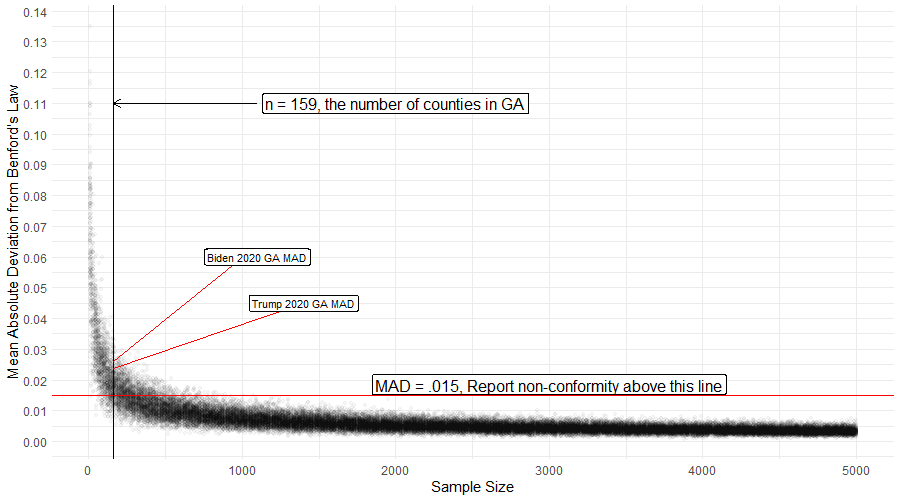

```{r setup, include=FALSE}
#knitr::opts_chunk$set(echo = TRUE)
library(benford.analysis)
library(shiny)
library(shinyWidgets)
library(plotly)
library(openxlsx)
library(ggpubr)
source('dig.distjd.R')
```

Robert Bonavito, CPA posted a video comparing the distribution of the first digit of the vote totals in GA counties to the expectation from Benford's Law <https://youtu.be/DoF3WS42w3M?t=573> and states the results are "...pointing to massive fraud". That video has been viewed almost 100,000 times as of Nov 22. But do the data really indicate massive fraud? The short answer is no. 

An objective assessment of the results is that they indicate that the distribution of 1st digits in by county vote totals in GA for each candidate may not be distributed according to Benford's Law, and that is **all** they indicate. Statistical non-conformance to an assumed distribution can never indicate causality. We cannot conclude that there is "massive fraud" in the Georgia data from these results alone. Non-conformance may be an indicator of something nefarious and it's possible he did additional analysis not demonstrated, but we don't know of it.

So the short answer may be a semantic argument, but I think it's an important one. Stating that there is evidence of massive fraud in an election is a serious matter. Vote totals that do not conform to Benford's Law **may** deviate because of manipulation, but the only reason deviation **might** indicate fraud or manipulation is if the true, unadulterated vote totals do conform to Benford's Law. 

So what about the long answer? Is it possible to know whether the true, unadulterated vote totals conform to the expectation or not? Do these results actually seem unusual? Is there really any evidence of fraud here? This document examines these questions and illustrates why the results in the video are not meaningful, and do not support the ascertion that the data indicate massive fraud. The source code to generate this document is available <https://github.com/jmdavis0352/GABenford>. 

## Background

Bonavito describes Benford's Law in the video, and many other sources are available that do the same, so I won't spend much time on it here, 
but it's helpful to look at some examples. Population data frequently conform to Benford's Law, which is probably why it can be useful in detecting election fraud, since vote totals are in some way functions population data in each county or precinct.  

I downloaded county level population data from the census website (<https://www2.census.gov/programs-surveys/popest/datasets/2010-2019/counties/totals/co-est2019-alldata.csv>), and compared the 1st digit distribution
of all 3,142 US county populations (from 2010) to the expectation from Benford's Law. 


```{r echo = FALSE}
library(ggplot2)
suppressPackageStartupMessages(library(tidyverse))
library(BeyondBenford)
## download county population data from the 2010 census
#countypop = read.csv("https://www2.census.gov/programs-surveys/popest/datasets/2010-2019/counties/totals/co-est2019-alldata.csv", header = T)
# filter out columns and state aggregate data (COUNTY = 0 indicates the total state population so we don't want to include it)
#countypop_filter <- countypop %>% filter(COUNTY != 0) %>% select(c(STNAME, CTYNAME, CENSUS2010POP))
#write.csv(countypop_filter,'county_population.csv', row.names = F)

county_populations <- read.csv('county_population.csv', header = T, stringsAsFactors = F)
# 
# county_benford <- benford(county_populations$CENSUS2010POP, number.of.digits = 1)
# 
# county_1d <- dig.distjd(county_populations$CENSUS2010POP, dig = 1, label = '3,142 US Counties', main = 'Distribution of Digits for all US counties')
# 
# png('images/benfordcounties.png', h = 3.5, w = 7, res = 400, units = 'in')
# county_1d$graph + annotate('text', x=3, y = .27, label = paste0('Mean Absolute Deviation (MAD): ', round(county_benford$MAD, 4), '\n', 'MAD Conformity - Nigrini (2012): ', county_benford$MAD.conformity, sep = ''), hjust = 0)
# dev.off()


```


Mmmmmm, lovely. Nigrini (2012) suggests the Mean Absolute Deviation between the observed and expected digit frequencies to assess conformance or non-conformance. (See "Benford's Law: Applications for Forensic Accounting, Auditing, and Fraud Detection"). The text in the graph indicates the distribution of 1st digits for US county populations has a MAD that Nigrini classifies as "Close conformity". Values above .015 indicate non-conformity based his guidelines for interpretation.

## Are the Results in GA Actually Unusual or Unexpected?
The results above for all counties across the U.S. were a good fit for Benford's Law, but what if we look the distribution of county populations in GA? Or any other state? Almost none of them conform to the expectation from Benford's Law according to the MAD criteria (Texas, Tennessee, and Missouri do). 
This does not mean they are fraudulent or manipulated (that we know of), it just means that the distribution of the 1st digits 
of populations for smaller subsets of counties in the U.S. are not well described by Benford's Law. The red dots indicate the expected values.  

```{r  echo=F}
inputPanel(
  
  pickerInput('selectstate', choices = unique(county_populations$STNAME[county_populations$STNAME != 'District of Columbia']), selected = 'Georgia', multiple = F)

)

renderPlot({
dat <- county_populations %>% filter(STNAME == input$selectstate) 
scounty_benford <- benford(dat$CENSUS2010POP, number.of.digits = 1)
p <- dig.distjd(dat$CENSUS2010POP, dig = 1, main = paste('Distribution of 1st digits for county populations in', input$selectstate), label = paste(dim(dat)[1], input$selectstate, 'Counties')) 

p$graph + annotate('text', x=4, y = .27, label = paste0('Mean Absolute Deviation (MAD): ', round(scounty_benford$MAD, 4), '\n', 'MAD Conformity - Nigrini (2012): ', scounty_benford$MAD.conformity, sep = ''), hjust = 0, size = 5.5) + theme(text = element_text(size = 15))

})


```

OK, but those are populations, which are not the same as votes. So I thought of looking at the number of active voters by county in GA (<https://sos.ga.gov/admin/uploads/Active_Voters_by_Race_Gender_as_of_November_1_2020.xlsx>). These 
also do not conform to the expectations of Benford's Law according to the MAD measure. 


```{r, echo=F}
# GA_activevoters <- read.xlsx("https://sos.ga.gov/admin/uploads/Active_Voters_by_Race_Gender_as_of_November_1_2020.xlsx", sheet = 'ACT_VOTERSBY_RACE_AND_GENDER', rows = 9:168, )
# GA_activevoters$TOTAL.VOTERS <- as.integer(GA_activevoters$TOTAL.VOTERS)
# write.xlsx(GA_activevoters, 'GA_Voters.xlsx')

# GA_activevoters <-read.xlsx('GA_Voters.xlsx')
# 
# GA_voters_benford <-benford(GA_activevoters$TOTAL.VOTERS, number.of.digits = 1)
# p <- dig.distjd(GA_activevoters$TOTAL.VOTERS, dig = 1, main = 'Distribution of 1st digit for active voters by county in GA', label = 'Active Voters')
# 
# png('/images/benfordactivevoters.png', h = 4, w = 7, units = 'in', res = 400)
# p$graph + annotate('text', x=3, y = .27, label = paste0('Mean Absolute Deviation (MAD): ', round(GA_voters_benford$MAD, 4), '\n', 'MAD Conformity - Nigrini (2012): ', GA_voters_benford$MAD.conformity, sep = ''), hjust = 0) 
# 
# dev.off()

```


```{css, echo=FALSE}
.shiny-flow-layout>div {
  display: inline-block;
  vertical-align: top;
  padding-right: 12px;
  width: 900px;}
```

Is all of this nefarious? There isn't any reason in these data to think so because with sample sizes equal to the number of counties, these results 
are not unusual. Suppose we randomly generate some data known to perfectly converge to Benford's Law and compare the 1st digit distributions to the expected values for various sample sizes. I'm generating such data by multiplying 10 independent random variables of different distributions and magnitudes together. Move the slider to generate a new data set of the specified sample size (after clicking it the <- -> arrow keys it move up or down by 1). Samples sizes of about 160 result in a data set that achieves conformance according to the MAD criteria about a third of the time. Samples larger than about 1500 almost universally report close conformance.  

``` {r echo = F}

inputPanel(
  
 sliderInput('samplesize', label = 'Specify Sample Size', min = 10, max = 5000, step = 1, value = 159,width = '800px' )
  
)
  

renderPlot({
  
Bdat <-data.frame(A = runif(input$samplesize, 0 , 100000), B = runif(input$samplesize), C = rpois(input$samplesize,300), D = rexp(input$samplesize,1/200), 
E = rnorm(input$samplesize,100000, 1000), FF = exp(runif(input$samplesize,0, 100)), G = 2^runif(input$samplesize,0, 30), H = runif(input$samplesize,0,100), I = rnbinom(input$samplesize,5, .3), J = rgamma(input$samplesize,2.4, 5))
  
Bdat$Benford <- apply(Bdat, 1, prod)
BenfordPerfect <- benford(Bdat$Benford, number.of.digits = 1)
  

p <- dig.distjd(Bdat$Benford , label = paste0('Product of 10 RV\n(n = ', input$samplesize, ')' ))  

p$graph  + annotate('text', x=3, y = .27, label = paste0('Mean Absolute Deviation (MAD): ', round(BenfordPerfect$MAD, 4), '\n', 'MAD Conformity - Nigrini (2012): ', BenfordPerfect$MAD.conformity, sep = ''), hjust = 0, size = 5.5) +theme(text = element_text(size = 16))

  
})

```

Just for fun I generated 30 independent sets of the data described above (product of 10 random variables) for each sample size ranging from 10 to 5000 in steps of 10 (i.e. I generated 30 independent samples with 10 data points in each, and 30 independent samples with 20 data points in each etc.). For each sample I calculated the 1st digit distributions and the MAD with resepct to Benford's Law, and then plotted the resulting MADs for each sample size below.  The plot below shows the distribution of MAD at each sample size. Georgia comprises 159 counties. So even if we are examining a number process that perfectly converges to Benford's Law, a sample size of 159 will frequently appear as non-conforming. 


```{r echo=F}
## library(foreach)
## library(doParallel)
##

# cl <-makeCluster(8)
# registerDoParallel(cl)
# 
# MAD <- foreach(i = seq(10, 5000, 10), .combine = rbind, .packages = c('foreach', 'benford.analysis')) %dopar% {
#  
#   inside <- foreach (j = 1:30, .combine = rbind) %do% {
#     
#     Bdat <-data.frame(A = runif(i, 0, 100000), B = runif(i), C = rpois(i, 300), D = rexp(i, 1/200), E = rnorm(i, 100000, 1000), 
#                       FF = exp(runif(i, 0, 100)), G = 2^runif(i, 0, 30), H = runif(i, 0,100), I = rnbinom(i, 5, .3), J = rgamma(i, 2.4, 5))
#     
#     Bdat$Benford <- apply(Bdat, 1, prod)
#     BenfordPerfect <- benford(Bdat$Benford, number.of.digits = 1)
#     
#     data.frame(n = i, MAD = rexpB$MAD)
#     
#   }
#    
# }
# 
# stopCluster(cl)

# write.csv(MAD, 'MAD.csv', row.names = F)

# MADdat <- read.csv('MAD.csv')
# 
# png('images/mad.png', h = 3.5, w = 7, res = 400, units = 'in')
# 
# ggplot(data = MADdat, aes(x = n, y = MAD)) + geom_point(alpha = .04 ) + geom_hline(yintercept = .015, colour = 'red') + xlab('Sample Size') +
#   geom_vline(xintercept =  159) + theme_minimal() +
#   annotate('label',x = 3000, y = .020, label = 'MAD = .015, Report non-conformity above this line') +
#   annotate('label', x = 2000, y = .08, label = 'n = 159, the number of counties in GA') +
#   annotate('segment', x = 800, y = .08, xend = 159, yend = .08, arrow = arrow(length = unit(0.02, "npc") ))
# 
# dev.off()

```


So what does all this mean? It means that the 1st digit distributions of state populations by county generally do not conform to Benford's law. The 1st digit distribution of the number of active voters by county in GA (as of Nov 1, 2020) do not conform to Benford's Law. Randomly generated data that is demonstrated to converge to Benford's Law, consistently does not conform to Benford's Law with sample sizes commensurate with the number of counties in GA and other states. Since vote counts by county are by necessity a function of the populations and number of registered voters in each county, and the sample size is by necessity the number of counties, it's not unexpected that vote counts for candidates in GA also do not conform to Benford's Law. But speaking of vote counts, we haven't examined them yet. 


```{r echo=F}

data2020 <- read.csv('2020GA.csv', stringsAsFactors = F)
data2020$BIDEN.VOTES <- gsub(',', '\\', data2020$BIDEN.VOTES)
data2020$BIDEN.VOTES <- as.integer(data2020$BIDEN.VOTES)
data2020$TRUMP.VOTES <- gsub(',' , '\\', data2020$TRUMP.VOTES)
data2020$TRUMP.VOTES <- as.integer(data2020$TRUMP.VOTES)

Bid<- dig.distjd(data2020$BIDEN.VOTES, dig = 1, main = "Comparison of Benford's Law (1st digit) to Biden Votes\n(159 counties)", label = 'Biden' )
BidBenford <- benford(data2020$BIDEN.VOTES, number.of.digits = 1)

Tru<- dig.distjd(data2020$TRUMP.VOTES, dig = 1, main = "Comparison of Benford's Law (1st digit) to Trump Votes\n(159 counties)", label = 'Trump' )
TruBenford <- benford(data2020$TRUMP.VOTES, number.of.digits = 1)


# BTdat <- rbind(subset(Bid$data , Distribution == 'Biden'), subset(Tru$data, Distribution == 'Trump'))
# 
# statsBid <-  data.frame(Distribution = 'Biden', label = paste0('Mean Absolute Deviation (MAD): ', round(BidBenford$MAD, 4), '\n', 'MAD Conformity - Nigrini (2012): ', BidBenford$MAD.conformity, sep = ''))
# 
# statsTru <- data.frame(Distribution = 'Trump', label = paste0('Mean Absolute Deviation (MAD): ', round(TruBenford$MAD, 4), '\n', 'MAD Conformity - Nigrini (2012): ', TruBenford$MAD.conformity, sep = ''))
# 
# stats <- rbind(statsBid, statsTru)
# stats$x <- 3
# stats$y <- .22
# 
# btab <- subset(Bid$data, Distribution == 'Benford')
# 
# png('images/GA2020.png', h = 3.5, w = 7, res = 400, units = 'in')
# ggplot(BTdat, aes(x = Digit, y = Freq.Prob) ) + 
#       geom_bar(stat = "identity", color = "black", position = position_dodge(), fill = 'grey80') + facet_grid(.~Distribution) + 
#   annotate('point', x = btab$Digit, y = btab$Freq.Prob, colour = 'red', size = 2) +
#       labs(title = '2020 GA Election 1st Digit Distributions', x = "Digit", y = "Probabilities") + 
#   theme(legend.title = element_blank()) + geom_text(data = stats, aes(x = x, y = y, label = label), size = 2.5, hjust = 0)
# 
# dev.off()

```

## Examining the Vote Tallys in GA
I downloaded the same data for vote totals by county from Politico as Bonavito, but my download was a few days later, so the results are not exactly the same, but close enough to reproduce what he describes in the video. The plots are below. Both vote tallies report non-conformance according to Nigrini's proposed MAD criteria. But based on the information above this doesn't seem particularly unusual. The MAD for both vote tallies fall within the range of those generated from samples of 159 pulled from a number process that *perfectly converges to Benford's Law* (recall the MAD vs sample size chart). But it doesn't hurt to be prudent and investigate these results.  


One thing that seems obvious to look at previous elections and see how these results compare. I pulled by county presidential election data from <https://dataverse.harvard.edu/dataset.xhtml?persistentId=doi:10.7910/DVN/VOQCHQ> and computed 1st digit distributions and MAD for each candidates totals by county. 

```{r echo=FALSE}
inputPanel(
  
  column(width = 4, pickerInput('selectyear1', choices = unique(county_populations$STNAME[county_populations$STNAME != 'District of Columbia']), selected = 'Georgia', multiple = F)), 
  column(width = 4, pickerInput('selectyear2'))

)

renderPlot({
dat <- county_populations %>% filter(STNAME == input$selectstate) 
scounty_benford <- benford(dat$CENSUS2010POP, number.of.digits = 1)
p <- dig.distjd(dat$CENSUS2010POP, dig = 1, main = paste('Distribution of 1st digits for county populations in', input$selectstate), label = paste(dim(dat)[1], input$selectstate, 'Counties')) 

p$graph + annotate('text', x=4, y = .27, label = paste0('Mean Absolute Deviation (MAD): ', round(scounty_benford$MAD, 4), '\n', 'MAD Conformity - Nigrini (2012): ', scounty_benford$MAD.conformity, sep = ''), hjust = 0, size = 5.5) + theme(text = element_text(size = 15))

})


#### *A Statistics Aside for Anyone Who Wants One*
We've only talked about the MAD criteria, but other statistical tests exist. **Chi square and Mantissa Arc tests do not provide evidence for non-conformance.**The p-values below describe the probability of getting these results from a sample of this size if they were drawn from a population conforming to the theretical (Benford's) distribution. A p-value of 0.10 means that if the sample came from a distribution that perfectly conformed to Benford's Law, you would get results that deviated this much in 1 out of 10 samples. So looking at the values below 

For Trump's data

* Chi square test p-value = `r as.numeric(round(BidBenford$stats$chisq$p.value, 4))`
* Mantissa arc test p-value = `r as.numeric(round(BidBenford$stats$mantissa.arc.test$p.value, 4))`

For Biden's data

* Chi square test p-value = `r as.numeric(round(TruBenford$stats$chisq$p.value, 4))`
* Mantissa arc test p-value = `r as.numeric(round(TruBenford$stats$mantissa.arc.test$p.value, 4))`

Combined with the MAD results the statistical evidence that the GA vote totals deviate from Benford's Law is weak or inconclusive. But even if the statistical deviation was powerful, there is more work to do before declaring massive fraud. 


